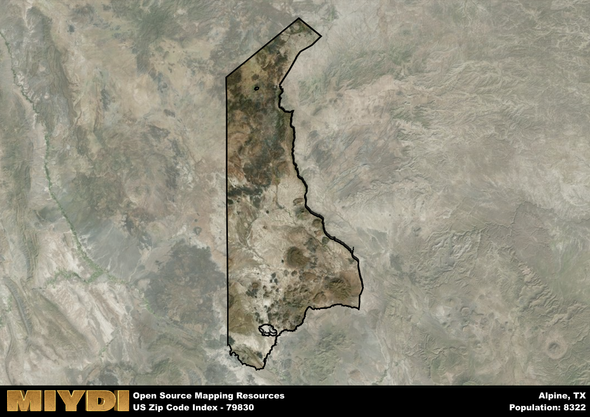

**Area Name:** Alpine

**Zip Code:** 79830

**State:** TX

# Alpine: A Historic and Vibrant Neighborhood in West Texas

Located in the heart of West Texas, zip code 79830 encompasses the charming neighborhood of Alpine. Bordered by the picturesque Davis Mountains to the north and the sprawling Chihuahuan Desert to the south, Alpine serves as a hub for the region, connecting nearby cities such as Marfa and Fort Davis. With its central location along Highway 90, Alpine plays a vital role in the transportation network of the area, attracting visitors and residents alike.

Alpine has a rich history dating back to the late 19th century when it was established as a water stop for the Galveston, Harrisburg, and San Antonio Railway. Over the years, the town grew into a thriving community, thanks to the establishment of Sul Ross State University in 1920. The university has since become a cornerstone of Alpine, contributing to its academic and cultural vibrancy. The town's name reflects its high elevation and cool climate, making it a popular destination for outdoor enthusiasts and nature lovers.

Today, Alpine boasts a diverse economy supported by sectors such as education, healthcare, and tourism. The town is home to a variety of local businesses, restaurants, and shops, offering residents and visitors a unique blend of amenities. Outdoor recreational opportunities abound in Alpine, with nearby attractions like Big Bend National Park and the McDonald Observatory attracting nature enthusiasts from far and wide. The town's historic downtown area, with its well-preserved buildings and art galleries, provides a glimpse into Alpine's storied past, making it a must-visit destination in West Texas.

# Alpine Demographics

The population of Alpine is 8322.  
Alpine has a population density of 3.62 per square mile.  
The area of Alpine is 2297.41 square miles.  

## Alpine Income and Economic Data

These demographic numbers are sourced from IRS return data, providing comprehensive insights into the population dynamics and economic trends within Alpine.

**Breakdown of return types for Alpine**

The table offers insight into the composition of tax returns filed with the IRS, categorizing them into three main types. Single returns represent filings by individuals, joint returns by married couples, and head of household returns by individuals who qualify as heads of households, typically having dependents. This breakdown provides an understanding of the different filing statuses adopted by taxpayers when submitting their tax documentation.

| Return Types filed for Alpine                              | Percentage          |
|----------------------------------------------------------|---------------------|
| Single Returns                                            | 0.53 |
| Joint Returns                                             | 0.35 |
| Head Household Returns                                    | 0.1 |

The income and economic data presented here is sourced from the IRS income brackets, utilized for categorizing tax returns by income levels. This table displays income ranges for both single filers and married couples, along with the corresponding number of returns and the percentage within each bracket, providing valuable insight into the distribution of taxes across various income groups.

| Bracket Name       | Single Filer Income Range | Married Couple Range | Number of Returns | Percentage of Returns |
|--------------------|----------------------------|----------------------|-------------------|-----------------------|
| 10% Bracket        | Up to $10,275              | Up to $20,550        | 960 | 0.36% |
| 12% Bracket        | $10,276 - $41,775          | $20,551 - $83,550    | 710 | 0.26% |
| 22% Bracket        | $41,776 - $89,075          | $83,551 - $178,150   | 370 | 0.14% |
| 24% Bracket        | $89,076 - $170,050         | $178,151 - $340,100  | 240 | 0.09% |
| 32% Bracket        | $170,051 - $215,950        | $340,101 - $431,900  | 330 | 0.12% |
| 35% Bracket        | $215,951 - $539,900        | $431,901 - $647,850  | 70 | 0.03% |

### Exploring Taxpayer Diversity: A Breakdown of Different Types of Tax Returns in Alpine

The table offers insights into various types of tax returns filed, reflecting different aspects of taxpayer activities and demographics. Categories include charitable returns for donations, dependent returns for claimed dependents, educator population, elderly population, real estate returns, self-employment returns, student loan returns, and unemployment returns, providing valuable insights into taxpayer behavior and demographics.

| Alpine Filing Types                    | Count | Percentage |
|--------------------------------------|-------|------------|
| Charitable Donations                 | 70 | 0.026% |
| Dependents Claimed                   | 40 | 0.015% |
| Educator Residents                   | 80 | 0.03% |
| Elderly Population                   | 790 | 0.29% |
| Farming Population                   | 40 | 0.015% |
| Real Estate Transactions             | 70 | 0.026% |
| Self-Employed Individuals            | 410 | 0.153% |
| Student Loan Cases                   | 210 | 0.078% |
| Unemployment Benefit Filings         | 230 | 0.09% |

## Alpine AI and Census Variables

The values presented in this dataset for Alpine are AI-optimized, streamlined, and categorized into relevant buckets for enhanced utility in AI and mapping programs. These simplified values have been optimized to facilitate efficient analysis and integration into various technological applications, offering users accessible and actionable insights into demographics within the Alpine area.

| AI Variables for Alpine | Value |
|-------------|-------|
| Shape Area | 7935010948.95313 |
| Shape Length | 586784.327442321 |

## How to use this free AI optimized Geo-Spatial Data for Alpine, TX

This data is made freely available under the Creative Commons license, allowing for unrestricted use for any purpose. Users can access static resources directly from GitHub or leverage more advanced functionalities by utilizing the GeoJSON files. All datasets originate from official government or private sector sources and are meticulously compiled into relevant datasets within QGIS. However, the versatility of the data ensures compatibility with any mapping application.

## Data Accuracy Disclaimer
It's important to note that the data provided here may contain errors or discrepancies and should be considered as 'close enough' for business applications and AI rather than a definitive source of truth. This data is aggregated from multiple sources, some of which publish information on wildly different intervals, leading to potential inconsistencies. Additionally, certain data points may not be corrected for Covid-related changes, further impacting accuracy. Moreover, the assumption that demographic trends are consistent throughout a region may lead to discrepancies, as trends often concentrate in areas of highest population density. As a result, dense areas may be slightly underrepresented, while rural areas may be slightly overrepresented, resulting in a more conservative dataset. Furthermore, the focus primarily on areas within US Major and Minor Statistical areas means that approximately 40 million Americans living outside of these areas may not be fully represented. Lastly, the historical background and area descriptions generated using AI are susceptible to potential mistakes, so users should exercise caution when interpreting the information provided.
