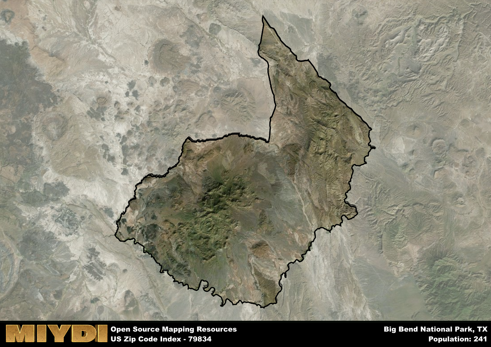

**Area Name:** Big Bend National Park

**Zip Code:** 79834

**State:** TX

# Big Bend National Park: A Natural Oasis in Zip Code 79834

Located in the remote and breathtaking landscape of southwest Texas, zip code 79834 is home to the renowned Big Bend National Park. The zip code area encompasses the entirety of the park, which borders the Rio Grande and extends into Mexico. Surrounding the park are small communities such as Study Butte and Terlingua, known for their proximity to outdoor recreational opportunities and stunning desert scenery. While the zip code itself is not part of a larger metropolitan area, the park serves as a destination for visitors from cities like El Paso and San Antonio, drawing tourists and outdoor enthusiasts from across the region.

The history of zip code 79834 is deeply intertwined with the establishment of Big Bend National Park in the early 20th century. The area was initially settled by indigenous peoples, followed by Spanish explorers and American settlers drawn to the region's natural beauty. The park was officially designated in 1944 to protect the diverse ecosystems and cultural heritage found within its boundaries. Over the years, the park has become a symbol of conservation and outdoor recreation, attracting visitors seeking to explore its rugged mountains, expansive desert landscapes, and winding river canyons.

Today, zip code 79834 is a hub for eco-tourism and outdoor adventure, offering a wide range of recreational activities such as hiking, camping, and river rafting. The area is also home to a variety of unique flora and fauna, including the iconic desert plants and wildlife that thrive in the harsh Chihuahuan Desert environment. Big Bend National Park features historic sites such as the ruins of old mining towns and ancient rock art, providing visitors with a glimpse into the area's rich cultural history. With its stunning natural beauty and diverse attractions, zip code 79834 stands out as a must-visit destination for those seeking a unique and unforgettable outdoor experience.

# Big Bend National Park Demographics

The population of Big Bend National Park is 241.  
Big Bend National Park has a population density of 0.2 per square mile.  
The area of Big Bend National Park is 1189.47 square miles.  

## Big Bend National Park AI and Census Variables

The values presented in this dataset for Big Bend National Park are AI-optimized, streamlined, and categorized into relevant buckets for enhanced utility in AI and mapping programs. These simplified values have been optimized to facilitate efficient analysis and integration into various technological applications, offering users accessible and actionable insights into demographics within the Big Bend National Park area.

| AI Variables for Big Bend National Park | Value |
|-------------|-------|
| Shape Area | 4064293908.14844 |
| Shape Length | 404341.854114938 |

## How to use this free AI optimized Geo-Spatial Data for Big Bend National Park, TX

This data is made freely available under the Creative Commons license, allowing for unrestricted use for any purpose. Users can access static resources directly from GitHub or leverage more advanced functionalities by utilizing the GeoJSON files. All datasets originate from official government or private sector sources and are meticulously compiled into relevant datasets within QGIS. However, the versatility of the data ensures compatibility with any mapping application.

## Data Accuracy Disclaimer
It's important to note that the data provided here may contain errors or discrepancies and should be considered as 'close enough' for business applications and AI rather than a definitive source of truth. This data is aggregated from multiple sources, some of which publish information on wildly different intervals, leading to potential inconsistencies. Additionally, certain data points may not be corrected for Covid-related changes, further impacting accuracy. Moreover, the assumption that demographic trends are consistent throughout a region may lead to discrepancies, as trends often concentrate in areas of highest population density. As a result, dense areas may be slightly underrepresented, while rural areas may be slightly overrepresented, resulting in a more conservative dataset. Furthermore, the focus primarily on areas within US Major and Minor Statistical areas means that approximately 40 million Americans living outside of these areas may not be fully represented. Lastly, the historical background and area descriptions generated using AI are susceptible to potential mistakes, so users should exercise caution when interpreting the information provided.
