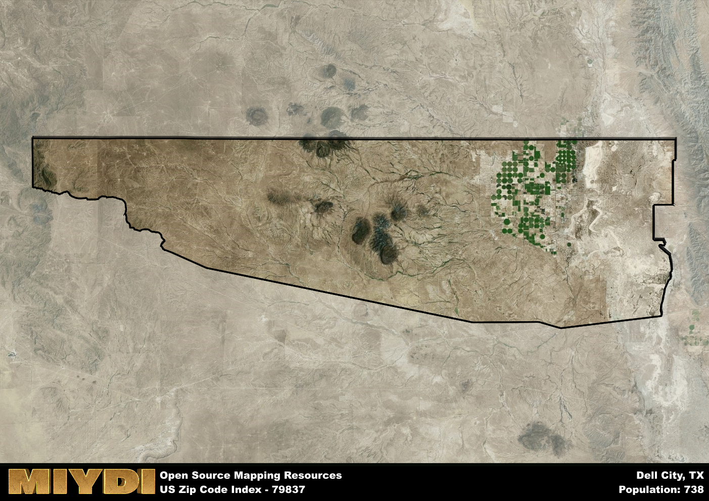

**Area Name:** Dell City

**Zip Code:** 79837

**State:** TX

Dell City is a part of the El Paso - TX Metro Area, and makes up 0.08% of the Metro's population.  

# Dell City: A Hidden Gem in West Texas

Dell City, located in the zip code 79837, is a small rural community situated in the western region of Texas. Bordered by the Guadalupe Mountains to the west and vast desert landscapes to the east, Dell City is an oasis of tranquility in an otherwise rugged terrain. While it is not part of a larger metropolitan area, Dell City is connected to neighboring towns such as Van Horn and Sierra Blanca, serving as a gateway to the stunning natural beauty of the region.

Originally settled in the early 20th century as a farming community, Dell City has since evolved into a close-knit town with a population of around 500 residents. Named after a local landowner, Dell City experienced a period of growth during the mid-20th century with the development of irrigation systems that supported agriculture in the area. Today, Dell City retains its agricultural roots, with farming and ranching playing a significant role in the local economy. The town's annual events, such as the Dell City Fair, celebrate its history and community spirit.

Despite its small size, Dell City offers a range of amenities for residents and visitors alike. The town features locally-owned businesses, a community center, and recreational opportunities such as hiking and birdwatching in the nearby mountains. Dell City is also home to the historic Dell City School, a reminder of the town's past and a focal point for community gatherings. With its unique blend of history, natural beauty, and small-town charm, Dell City is a hidden gem waiting to be discovered in West Texas.

# Dell City Demographics

The population of Dell City is 738.  
Dell City has a population density of 0.89 per square mile.  
The area of Dell City is 831.27 square miles.  

### Exploring Real Estate Trends: A Comprehensive Analysis of the Dell City Area and its Neighbors

This table contains an in-depth examination of the real estate market in the Dell City area. Sourced from trusted real estate market firms, this dataset provides a wealth of raw data detailing the local real estate landscape, along with comparative analyses juxtaposing the market dynamics with those of neighboring areas. Explore the intricacies of the Dell City real estate market and gain valuable insights into its relationship with adjacent regions.

| Real Estate Data for Dell City                       | Value    |
|------------------------------------------------|----------|
| Average Listing Price for Dell City               | 87500 |
| Median Listing Price for Dell City                | 87500 |
| Median Days on Market for Dell City               | 135 |
| Median Listing Price per Square Foot for Dell City| 3 |
| Median Square Feet for Dell City                  | 1200 |
| Real Estate Prices to Income Ratio           | 53.43% |
| Price per Square Foot Ratio                  | 49.51% |
| Price Median Ratio                           | 30.10% |
| Market Sales Speed Ratio                     | 197.7% |

This table offers essential real estate data for the Dell City area, including average and median listing prices, median days on market, and property size. It also presents ratio metrics as percentages, providing insights into how the local market compares to the surrounding region. A ratio of 100% signifies performance in line with the regional average, while values above or below indicate overperformance or underperformance, respectively, relative to expectations.

## Dell City Sports and Recreation Data

#### Annual Youth Sports Spending for Dell City

This table provides fundamental insights into the Sports and Recreation data for the Dell City area, detailing the estimated annual expenditure on Youth Athletics. This includes estimated spending by the major consumer brackets. 
| Sports Spending for Dell City| Value |
|-------------------------|-------|
| Athlete Spending Compared to the region | 2.22% |
| Total Youth Athlete Spending | 15,605 |
| Athletic Spending - Essential Focused Consumer | 7,387 |
| Athletic Spending - Typical Consumer | 2,170 |
| Athletic Spending - Affluent Consumers | 6,024 |

#### Youth Coaching Estimates for Dell City

This table presents the estimated number of coaches for the Dell City area, derived from comprehensive national coaching surveys and athletic participation rates by state. It offers valuable insights into the vital role of coaching personnel in fostering athletic development and facilitating sports participation within the local community.

| Coaching Data for Dell City | Value |
|-------------|-------|
| Total Coaches | 12 |
| Paid Coaches | 3 |
| Volunteer Coaches | 9 |

#### Youth Athlete Participation for Dell City

This table shows the estimated total number of youth athletes in the Dell City area, sourced from comprehensive national coaching surveys and athletic participation rates by state.

| Total YA Athletes in Dell City | Value |
|-------------|-------|
| Total High School Athletes | 18 |
| Total Youth Athletes | 55 |
| Total Young Adult Athletes | 37 |
| Total Athletes to Age 25 | 111 |

#### High School Age Athletes - Breakdown by Sport for Dell City

This table shows insights regarding high school age estimated players by sport in the Dell City area, derived from national and state-level athletic participation trends. 

| HS Players by Sport in Dell City | Value |
|-------------|-------|
| Football Players | 4 |
| Basketball Players | 3 |
| Soccer Players | 2 |
| Volleyball Players | 1 |
| Baseball Players | 2 |
| Tennis Players | 1 |
| Track Athletes | 3 |
| Golf Players | 1 |
| Swimming Athletes | 1 |
| Wrestling Competitors | 1 |
| Lacrosse Players | 0 |

Estimating the number of younger athletes presents unique challenges due to their varied starting ages, typically beginning around six years old, and a gradual decline in participation rates as they age. Unlike high school-aged athletes, younger athletes are less likely to switch sports as they grow older, contributing to the stability of participation numbers within specific sports at younger ages.  

As a general trend, the total number of younger athletes is approximately three times the number of high school-aged athletes, underscoring the significant presence of youth athletes in sports programs and highlighting the importance of early engagement in athletic activities.

## Dell City AI and Census Variables

The values presented in this dataset for Dell City are AI-optimized, streamlined, and categorized into relevant buckets for enhanced utility in AI and mapping programs. These simplified values have been optimized to facilitate efficient analysis and integration into various technological applications, offering users accessible and actionable insights into demographics within the Dell City area.

| AI Variables for Dell City | Value |
|-------------|-------|
| Shape Area | 2995546938.01563 |
| Shape Length | 293462.127686814 |
| CBSA Federal Processing Standard Code | 21340 |
| RE Price per Square Foot Ratio | 49.51% |
| RE Speed Ratio | 197.7% |
| RE Income Ratio | 53.43% |
| Income Bracket Flag | 2 |
| RE Income Flag | 1 |
| RE Median Square Footage Price Flag | 1 |
| RE Median Square Footage Size Flag | 1 |
| RE Activity Flag | 7 |
| Poverty Line Risk Flag | 2 |

## How to use this free AI optimized Geo-Spatial Data for Dell City, TX

This data is made freely available under the Creative Commons license, allowing for unrestricted use for any purpose. Users can access static resources directly from GitHub or leverage more advanced functionalities by utilizing the GeoJSON files. All datasets originate from official government or private sector sources and are meticulously compiled into relevant datasets within QGIS. However, the versatility of the data ensures compatibility with any mapping application.

## Data Accuracy Disclaimer
It's important to note that the data provided here may contain errors or discrepancies and should be considered as 'close enough' for business applications and AI rather than a definitive source of truth. This data is aggregated from multiple sources, some of which publish information on wildly different intervals, leading to potential inconsistencies. Additionally, certain data points may not be corrected for Covid-related changes, further impacting accuracy. Moreover, the assumption that demographic trends are consistent throughout a region may lead to discrepancies, as trends often concentrate in areas of highest population density. As a result, dense areas may be slightly underrepresented, while rural areas may be slightly overrepresented, resulting in a more conservative dataset. Furthermore, the focus primarily on areas within US Major and Minor Statistical areas means that approximately 40 million Americans living outside of these areas may not be fully represented. Lastly, the historical background and area descriptions generated using AI are susceptible to potential mistakes, so users should exercise caution when interpreting the information provided.
