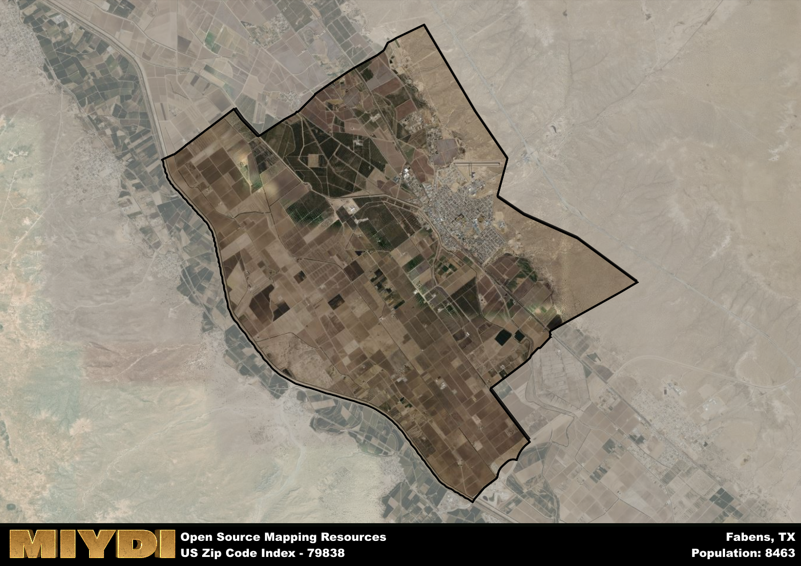

**Area Name:** Fabens

**Zip Code:** 79838

**State:** TX

Fabens is a part of the El Paso - TX Metro Area, and makes up 0.87% of the Metro's population.  

# Fabens: A Historic Gem in West Texas  

Located in El Paso County, Texas, the zip code 79838 encompasses the charming neighborhood of Fabens. Situated in the western part of the county, Fabens is bordered by the city of San Elizario to the north and the town of Tornillo to the south. This area is an integral part of the greater El Paso metropolitan area, known for its vibrant culture and strong sense of community. Fabens serves as a residential hub for many families who work in nearby cities and towns, providing a peaceful retreat from the hustle and bustle of urban life.  

Fabens has a rich history dating back to the late 19th century when it was founded as a farming community. The area flourished due to its fertile soil and access to the Rio Grande River, attracting settlers looking to cultivate the land. Over the years, Fabens grew into a close-knit community with a strong agricultural heritage, with farming and ranching playing a significant role in its economy. The town was named after George Fabens, a civil engineer who was involved in the construction of the Southern Pacific Railroad that passed through the area.  

Today, Fabens remains a thriving community with a mix of residential and agricultural land. The area is known for its local farmers' markets, showcasing fresh produce grown in the surrounding fields. Residents enjoy a range of recreational activities, including hiking in nearby mountains and exploring historical sites such as the San Elizario Presidio Chapel. Fabens continues to preserve its cultural heritage through events and festivals that celebrate its rich history. With its picturesque landscape and strong sense of community, Fabens is a hidden gem in the heart of West Texas.  

# Fabens Demographics

The population of Fabens is 8463.  
Fabens has a population density of 263.81 per square mile.  
The area of Fabens is 32.08 square miles.  

### Exploring Real Estate Trends: A Comprehensive Analysis of the Fabens Area and its Neighbors

This table contains an in-depth examination of the real estate market in the Fabens area. Sourced from trusted real estate market firms, this dataset provides a wealth of raw data detailing the local real estate landscape, along with comparative analyses juxtaposing the market dynamics with those of neighboring areas. Explore the intricacies of the Fabens real estate market and gain valuable insights into its relationship with adjacent regions.

| Real Estate Data for Fabens                       | Value    |
|------------------------------------------------|----------|
| Average Listing Price for Fabens               | 494810 |
| Median Listing Price for Fabens                | 63750 |
| Median Days on Market for Fabens               | 47 |
| Median Listing Price per Square Foot for Fabens| 3 |
| Median Square Feet for Fabens                  | 1200 |
| Real Estate Prices to Income Ratio           | 454.31% |
| Price per Square Foot Ratio                  | 35.94% |
| Price Median Ratio                           | 21.93% |
| Market Sales Speed Ratio                     | 68.8% |

This table offers essential real estate data for the Fabens area, including average and median listing prices, median days on market, and property size. It also presents ratio metrics as percentages, providing insights into how the local market compares to the surrounding region. A ratio of 100% signifies performance in line with the regional average, while values above or below indicate overperformance or underperformance, respectively, relative to expectations.

## Fabens Sports and Recreation Data

#### Annual Youth Sports Spending for Fabens

This table provides fundamental insights into the Sports and Recreation data for the Fabens area, detailing the estimated annual expenditure on Youth Athletics. This includes estimated spending by the major consumer brackets. 
| Sports Spending for Fabens| Value |
|-------------------------|-------|
| Athlete Spending Compared to the region | 25.40% |
| Total Youth Athlete Spending | ,320,791 |
| Athletic Spending - Essential Focused Consumer | 99,106 |
| Athletic Spending - Typical Consumer | 96,549 |
| Athletic Spending - Affluent Consumers | 24,858 |

#### Youth Coaching Estimates for Fabens

This table presents the estimated number of coaches for the Fabens area, derived from comprehensive national coaching surveys and athletic participation rates by state. It offers valuable insights into the vital role of coaching personnel in fostering athletic development and facilitating sports participation within the local community.

| Coaching Data for Fabens | Value |
|-------------|-------|
| Total Coaches | 138 |
| Paid Coaches | 36 |
| Volunteer Coaches | 102 |

#### Youth Athlete Participation for Fabens

This table shows the estimated total number of youth athletes in the Fabens area, sourced from comprehensive national coaching surveys and athletic participation rates by state.

| Total YA Athletes in Fabens | Value |
|-------------|-------|
| Total High School Athletes | 211 |
| Total Youth Athletes | 634 |
| Total Young Adult Athletes | 423 |
| Total Athletes to Age 25 | 1269 |

#### High School Age Athletes - Breakdown by Sport for Fabens

This table shows insights regarding high school age estimated players by sport in the Fabens area, derived from national and state-level athletic participation trends. 

| HS Players by Sport in Fabens | Value |
|-------------|-------|
| Football Players | 49 |
| Basketball Players | 30 |
| Soccer Players | 23 |
| Volleyball Players | 15 |
| Baseball Players | 25 |
| Tennis Players | 13 |
| Track Athletes | 36 |
| Golf Players | 6 |
| Swimming Athletes | 6 |
| Wrestling Competitors | 6 |
| Lacrosse Players | 0 |

Estimating the number of younger athletes presents unique challenges due to their varied starting ages, typically beginning around six years old, and a gradual decline in participation rates as they age. Unlike high school-aged athletes, younger athletes are less likely to switch sports as they grow older, contributing to the stability of participation numbers within specific sports at younger ages.  

As a general trend, the total number of younger athletes is approximately three times the number of high school-aged athletes, underscoring the significant presence of youth athletes in sports programs and highlighting the importance of early engagement in athletic activities.

## Fabens AI and Census Variables

The values presented in this dataset for Fabens are AI-optimized, streamlined, and categorized into relevant buckets for enhanced utility in AI and mapping programs. These simplified values have been optimized to facilitate efficient analysis and integration into various technological applications, offering users accessible and actionable insights into demographics within the Fabens area.

| AI Variables for Fabens | Value |
|-------------|-------|
| Shape Area | 114639448.382813 |
| Shape Length | 49640.0615531488 |
| CBSA Federal Processing Standard Code | 21340 |
| RE Price per Square Foot Ratio | 35.94% |
| RE Price Average Ratio | 138.35% |
| RE Speed Ratio | 68.8% |
| RE Income Ratio | 454.31% |
| RE Affordability Index Flag | 6 |
| Income Bracket Flag | 1 |
| RE Income Flag | 7 |
| RE Median Square Footage Price Flag | 1 |
| RE Median Square Footage Size Flag | 1 |
| RE Activity Flag | 3 |
| Poverty Line Risk Flag | 1 |

## How to use this free AI optimized Geo-Spatial Data for Fabens, TX

This data is made freely available under the Creative Commons license, allowing for unrestricted use for any purpose. Users can access static resources directly from GitHub or leverage more advanced functionalities by utilizing the GeoJSON files. All datasets originate from official government or private sector sources and are meticulously compiled into relevant datasets within QGIS. However, the versatility of the data ensures compatibility with any mapping application.

## Data Accuracy Disclaimer
It's important to note that the data provided here may contain errors or discrepancies and should be considered as 'close enough' for business applications and AI rather than a definitive source of truth. This data is aggregated from multiple sources, some of which publish information on wildly different intervals, leading to potential inconsistencies. Additionally, certain data points may not be corrected for Covid-related changes, further impacting accuracy. Moreover, the assumption that demographic trends are consistent throughout a region may lead to discrepancies, as trends often concentrate in areas of highest population density. As a result, dense areas may be slightly underrepresented, while rural areas may be slightly overrepresented, resulting in a more conservative dataset. Furthermore, the focus primarily on areas within US Major and Minor Statistical areas means that approximately 40 million Americans living outside of these areas may not be fully represented. Lastly, the historical background and area descriptions generated using AI are susceptible to potential mistakes, so users should exercise caution when interpreting the information provided.
