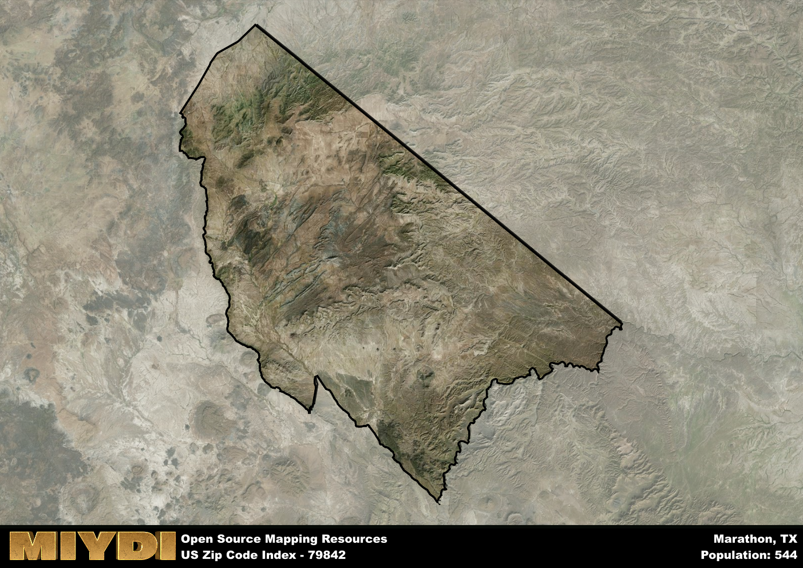

**Area Name:** Marathon

**Zip Code:** 79842

**State:** TX

# Exploring the Charming Neighborhood of Marathon (Zip Code 79842)

Located in the heart of West Texas, the zip code 79842 area corresponds to the quaint neighborhood of Marathon. Situated in Brewster County, Marathon is surrounded by the vast expanse of the Chihuahuan Desert, with Big Bend National Park to the south and the city of Alpine to the east. Despite its remote location, Marathon serves as a gateway to numerous outdoor adventures and is an integral part of the region's tourism industry.

Marathon has a rich history dating back to the late 19th century when it was founded as a water stop for the railroad. The town experienced a boom with the discovery of silver in the nearby mountains, attracting settlers and entrepreneurs looking to capitalize on the mining industry. Over time, Marathon evolved into a charming community known for its historic architecture, including the Gage Hotel, which stands as a testament to the town's past prosperity.

Today, Marathon continues to thrive as a hub for visitors exploring the rugged beauty of West Texas. The town's economy is centered around tourism, with boutique shops, art galleries, and restaurants catering to travelers passing through. Outdoor enthusiasts are drawn to Marathon for its proximity to Big Bend National Park, offering hiking, camping, and stargazing opportunities. In addition to its natural attractions, Marathon also boasts cultural landmarks such as the historic Post Park and the Marathon Historical Museum, preserving the town's unique heritage for future generations.

# Marathon Demographics

The population of Marathon is 544.  
Marathon has a population density of 0.2 per square mile.  
The area of Marathon is 2696.22 square miles.  

## Marathon AI and Census Variables

The values presented in this dataset for Marathon are AI-optimized, streamlined, and categorized into relevant buckets for enhanced utility in AI and mapping programs. These simplified values have been optimized to facilitate efficient analysis and integration into various technological applications, offering users accessible and actionable insights into demographics within the Marathon area.

| AI Variables for Marathon | Value |
|-------------|-------|
| Shape Area | 9346577885.82422 |
| Shape Length | 504576.59594352 |

## How to use this free AI optimized Geo-Spatial Data for Marathon, TX

This data is made freely available under the Creative Commons license, allowing for unrestricted use for any purpose. Users can access static resources directly from GitHub or leverage more advanced functionalities by utilizing the GeoJSON files. All datasets originate from official government or private sector sources and are meticulously compiled into relevant datasets within QGIS. However, the versatility of the data ensures compatibility with any mapping application.

## Data Accuracy Disclaimer
It's important to note that the data provided here may contain errors or discrepancies and should be considered as 'close enough' for business applications and AI rather than a definitive source of truth. This data is aggregated from multiple sources, some of which publish information on wildly different intervals, leading to potential inconsistencies. Additionally, certain data points may not be corrected for Covid-related changes, further impacting accuracy. Moreover, the assumption that demographic trends are consistent throughout a region may lead to discrepancies, as trends often concentrate in areas of highest population density. As a result, dense areas may be slightly underrepresented, while rural areas may be slightly overrepresented, resulting in a more conservative dataset. Furthermore, the focus primarily on areas within US Major and Minor Statistical areas means that approximately 40 million Americans living outside of these areas may not be fully represented. Lastly, the historical background and area descriptions generated using AI are susceptible to potential mistakes, so users should exercise caution when interpreting the information provided.
