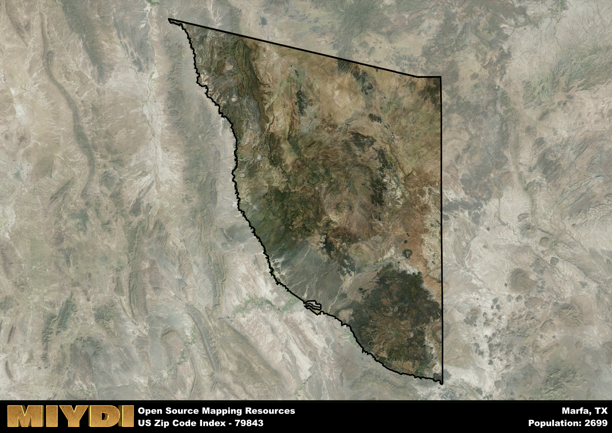

**Area Name:** Marfa

**Zip Code:** 79843

**State:** TX

# Marfa: A Unique Blend of Art, Culture, and History  

Located in the vast expanse of West Texas, zip code 79843 encompasses the charming town of Marfa. Situated in the high desert plains, Marfa is surrounded by the rugged beauty of the Chihuahuan Desert and the Davis Mountains. The town serves as an oasis of creativity and culture, drawing visitors from around the world with its unique art installations, historic architecture, and stunning natural landscapes. Marfa is approximately 60 miles from the larger city of Alpine and 200 miles from El Paso, making it an integral part of the region's urban fabric.  

Marfa has a rich historical narrative that dates back to the late 19th century when the town was established as a railroad water stop. Over the years, Marfa grew into a bustling hub for ranching and agriculture, attracting settlers with its promise of fertile land and a temperate climate. In the 20th century, Marfa became known for its iconic architecture, including the historic Presidio County Courthouse and the mysterious Marfa Lights phenomenon, which continues to intrigue visitors to this day. The town's unique blend of Spanish, Mexican, and Anglo influences has shaped its vibrant cultural identity.  

Today, Marfa is a thriving community known for its burgeoning art scene, eclectic shops, and gourmet dining options. The town is home to the internationally renowned Chinati Foundation, a contemporary art museum housed in a former military base. Visitors can also explore the historic Fort D.A. Russell, now converted into a luxury hotel, and enjoy the stunning views from the top of the nearby Marfa Plateau. With a mix of local businesses, galleries, and cultural events, Marfa offers a one-of-a-kind experience that celebrates the intersection of art, culture, and history in the heart of West Texas.

# Marfa Demographics

The population of Marfa is 2699.  
Marfa has a population density of 0.7 per square mile.  
The area of Marfa is 3844.96 square miles.  

## Marfa Income and Economic Data

These demographic numbers are sourced from IRS return data, providing comprehensive insights into the population dynamics and economic trends within Marfa.

**Breakdown of return types for Marfa**

The table offers insight into the composition of tax returns filed with the IRS, categorizing them into three main types. Single returns represent filings by individuals, joint returns by married couples, and head of household returns by individuals who qualify as heads of households, typically having dependents. This breakdown provides an understanding of the different filing statuses adopted by taxpayers when submitting their tax documentation.

| Return Types filed for Marfa                              | Percentage          |
|----------------------------------------------------------|---------------------|
| Single Returns                                            | 0.57 |
| Joint Returns                                             | 0.28 |
| Head Household Returns                                    | 0.12 |

The income and economic data presented here is sourced from the IRS income brackets, utilized for categorizing tax returns by income levels. This table displays income ranges for both single filers and married couples, along with the corresponding number of returns and the percentage within each bracket, providing valuable insight into the distribution of taxes across various income groups.

| Bracket Name       | Single Filer Income Range | Married Couple Range | Number of Returns | Percentage of Returns |
|--------------------|----------------------------|----------------------|-------------------|-----------------------|
| 10% Bracket        | Up to $10,275              | Up to $20,550        | 460 | 0.38% |
| 12% Bracket        | $10,276 - $41,775          | $20,551 - $83,550    | 340 | 0.28% |
| 22% Bracket        | $41,776 - $89,075          | $83,551 - $178,150   | 190 | 0.16% |
| 24% Bracket        | $89,076 - $170,050         | $178,151 - $340,100  | 80 | 0.07% |
| 32% Bracket        | $170,051 - $215,950        | $340,101 - $431,900  | 100 | 0.08% |
| 35% Bracket        | $215,951 - $539,900        | $431,901 - $647,850  | 50 | 0.04% |

### Exploring Taxpayer Diversity: A Breakdown of Different Types of Tax Returns in Marfa

The table offers insights into various types of tax returns filed, reflecting different aspects of taxpayer activities and demographics. Categories include charitable returns for donations, dependent returns for claimed dependents, educator population, elderly population, real estate returns, self-employment returns, student loan returns, and unemployment returns, providing valuable insights into taxpayer behavior and demographics.

| Marfa Filing Types                    | Count | Percentage |
|--------------------------------------|-------|------------|
| Charitable Donations                 | 30 | 0.025% |
| Dependents Claimed                   | 0 | 0% |
| Educator Residents                   | 0 | 0% |
| Elderly Population                   | 330 | 0.27% |
| Farming Population                   | 40 | 0.033% |
| Real Estate Transactions             | 20 | 0.016% |
| Self-Employed Individuals            | 280 | 0.23% |
| Student Loan Cases                   | 70 | 0.057% |
| Unemployment Benefit Filings         | 200 | 0.16% |

## Marfa AI and Census Variables

The values presented in this dataset for Marfa are AI-optimized, streamlined, and categorized into relevant buckets for enhanced utility in AI and mapping programs. These simplified values have been optimized to facilitate efficient analysis and integration into various technological applications, offering users accessible and actionable insights into demographics within the Marfa area.

| AI Variables for Marfa | Value |
|-------------|-------|
| Shape Area | 13323607388.7188 |
| Shape Length | 658079.900249582 |

## How to use this free AI optimized Geo-Spatial Data for Marfa, TX

This data is made freely available under the Creative Commons license, allowing for unrestricted use for any purpose. Users can access static resources directly from GitHub or leverage more advanced functionalities by utilizing the GeoJSON files. All datasets originate from official government or private sector sources and are meticulously compiled into relevant datasets within QGIS. However, the versatility of the data ensures compatibility with any mapping application.

## Data Accuracy Disclaimer
It's important to note that the data provided here may contain errors or discrepancies and should be considered as 'close enough' for business applications and AI rather than a definitive source of truth. This data is aggregated from multiple sources, some of which publish information on wildly different intervals, leading to potential inconsistencies. Additionally, certain data points may not be corrected for Covid-related changes, further impacting accuracy. Moreover, the assumption that demographic trends are consistent throughout a region may lead to discrepancies, as trends often concentrate in areas of highest population density. As a result, dense areas may be slightly underrepresented, while rural areas may be slightly overrepresented, resulting in a more conservative dataset. Furthermore, the focus primarily on areas within US Major and Minor Statistical areas means that approximately 40 million Americans living outside of these areas may not be fully represented. Lastly, the historical background and area descriptions generated using AI are susceptible to potential mistakes, so users should exercise caution when interpreting the information provided.
