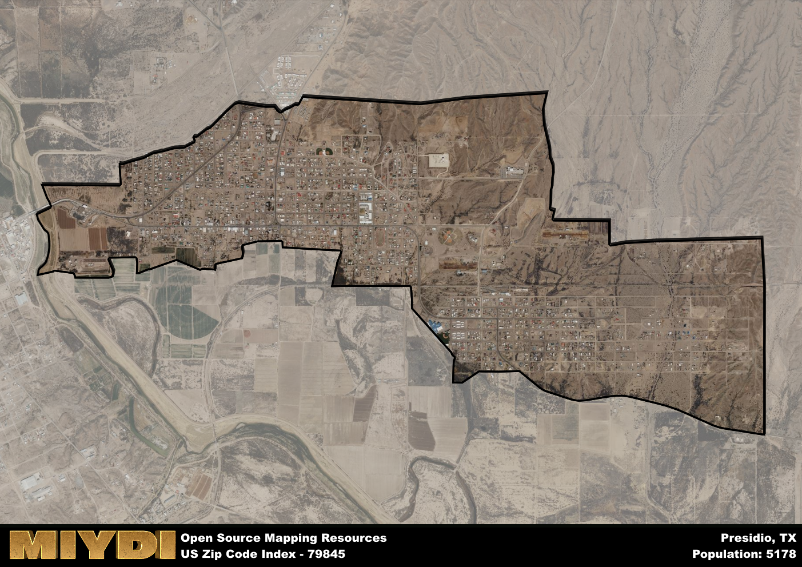

**Area Name:** Presidio

**Zip Code:** 79845

**State:** TX

# Presidio: A Historic Border Town in West Texas  

Located in the far west of Texas, the zip code 79845 area corresponds to the town of Presidio, nestled along the Rio Grande River and bordering Mexico. The town serves as a gateway to Big Bend National Park and is situated in a remote region with vast desert landscapes. Presidio is connected to nearby towns such as Marfa and Alpine, forming a network of communities in the region.

Presidio has a rich historical narrative, originally established as a military post in the 19th century to protect the border region. Over time, the town evolved into a vibrant community with a diverse population reflecting its proximity to Mexico. The name Presidio, meaning "fort" in Spanish, pays homage to its origins as a military outpost.

Today, Presidio is a bustling border town with a mix of agricultural and retail businesses supporting its economy. The town offers essential services such as schools, healthcare facilities, and local shops. Residents and visitors can enjoy outdoor recreational activities in the surrounding desert landscape, as well as explore historic sites like Fort Leaton State Historic Site, showcasing the town's frontier past. Presidio remains a unique cultural and historical destination within the larger West Texas region.

# Presidio Demographics

The population of Presidio is 5178.  
Presidio has a population density of 1212.65 per square mile.  
The area of Presidio is 4.27 square miles.  

## Presidio AI and Census Variables

The values presented in this dataset for Presidio are AI-optimized, streamlined, and categorized into relevant buckets for enhanced utility in AI and mapping programs. These simplified values have been optimized to facilitate efficient analysis and integration into various technological applications, offering users accessible and actionable insights into demographics within the Presidio area.

| AI Variables for Presidio | Value |
|-------------|-------|
| Shape Area | 14680320.859375 |
| Shape Length | 23653.8317482669 |

## How to use this free AI optimized Geo-Spatial Data for Presidio, TX

This data is made freely available under the Creative Commons license, allowing for unrestricted use for any purpose. Users can access static resources directly from GitHub or leverage more advanced functionalities by utilizing the GeoJSON files. All datasets originate from official government or private sector sources and are meticulously compiled into relevant datasets within QGIS. However, the versatility of the data ensures compatibility with any mapping application.

## Data Accuracy Disclaimer
It's important to note that the data provided here may contain errors or discrepancies and should be considered as 'close enough' for business applications and AI rather than a definitive source of truth. This data is aggregated from multiple sources, some of which publish information on wildly different intervals, leading to potential inconsistencies. Additionally, certain data points may not be corrected for Covid-related changes, further impacting accuracy. Moreover, the assumption that demographic trends are consistent throughout a region may lead to discrepancies, as trends often concentrate in areas of highest population density. As a result, dense areas may be slightly underrepresented, while rural areas may be slightly overrepresented, resulting in a more conservative dataset. Furthermore, the focus primarily on areas within US Major and Minor Statistical areas means that approximately 40 million Americans living outside of these areas may not be fully represented. Lastly, the historical background and area descriptions generated using AI are susceptible to potential mistakes, so users should exercise caution when interpreting the information provided.
