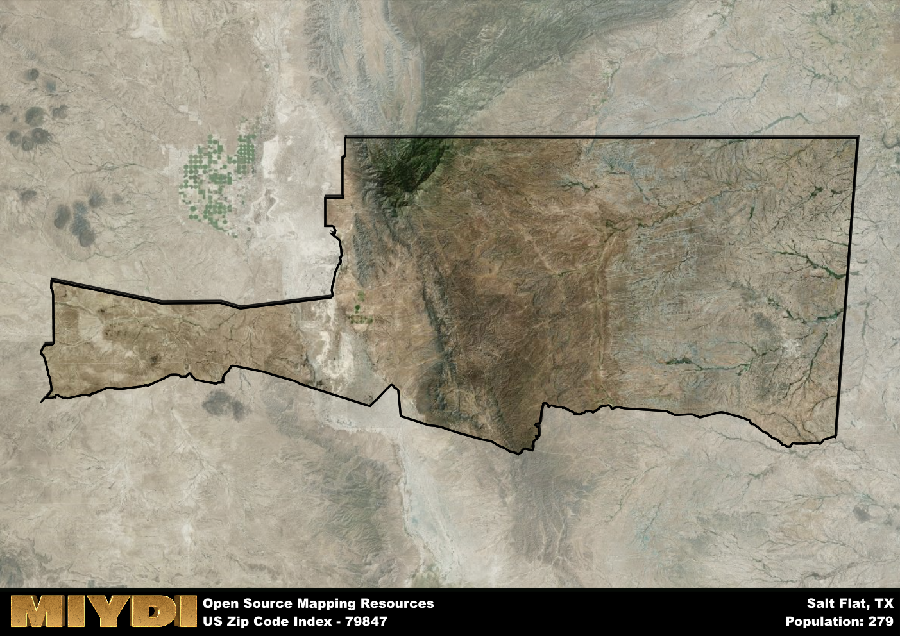

**Area Name:** Salt Flat

**Zip Code:** 79847

**State:** TX

Salt Flat is a part of the El Paso - TX Metro Area, and makes up  of the Metro's population.  

# Salt Flat: A Unique Community in West Texas  

Located in the vast and desolate landscape of West Texas, the zip code 79847 encompasses the small community of Salt Flat. Situated near the Texas-New Mexico border, Salt Flat is surrounded by the stunning Guadalupe Mountains National Park to the east and the sprawling desert plains to the west. While the area itself is sparsely populated, it serves as a pit stop for travelers on their way to nearby cities such as El Paso and Carlsbad.

Salt Flat has a rich history dating back to the early days of Spanish colonization in the region. Originally established as a trading post along the Butterfield Overland Mail route in the mid-19th century, Salt Flat quickly grew into a hub for travelers and traders crossing the harsh desert terrain. The name "Salt Flat" was derived from the nearby salt deposits that were once harvested for commercial use. Today, the area retains its frontier charm and historical significance, attracting visitors interested in its unique past.

Despite its remote location, Salt Flat offers a range of services and amenities for residents and visitors alike. The community is known for its outdoor recreational opportunities, including hiking, camping, and off-roading in the surrounding desert landscape. Additionally, the area is home to several local businesses, such as gas stations, restaurants, and motels, catering to the needs of travelers passing through. Salt Flat also boasts a rich cultural heritage, with historic sites and landmarks that showcase its role in the development of the region.

# Salt Flat Demographics

The population of Salt Flat is 279.  
Salt Flat has a population density of 0.15 per square mile.  
The area of Salt Flat is 1922.44 square miles.  

## Salt Flat AI and Census Variables

The values presented in this dataset for Salt Flat are AI-optimized, streamlined, and categorized into relevant buckets for enhanced utility in AI and mapping programs. These simplified values have been optimized to facilitate efficient analysis and integration into various technological applications, offering users accessible and actionable insights into demographics within the Salt Flat area.

| AI Variables for Salt Flat | Value |
|-------------|-------|
| Shape Area | 6909175296.29297 |
| Shape Length | 483473.778824015 |
| CBSA Federal Processing Standard Code | 21340 |

## How to use this free AI optimized Geo-Spatial Data for Salt Flat, TX

This data is made freely available under the Creative Commons license, allowing for unrestricted use for any purpose. Users can access static resources directly from GitHub or leverage more advanced functionalities by utilizing the GeoJSON files. All datasets originate from official government or private sector sources and are meticulously compiled into relevant datasets within QGIS. However, the versatility of the data ensures compatibility with any mapping application.

## Data Accuracy Disclaimer
It's important to note that the data provided here may contain errors or discrepancies and should be considered as 'close enough' for business applications and AI rather than a definitive source of truth. This data is aggregated from multiple sources, some of which publish information on wildly different intervals, leading to potential inconsistencies. Additionally, certain data points may not be corrected for Covid-related changes, further impacting accuracy. Moreover, the assumption that demographic trends are consistent throughout a region may lead to discrepancies, as trends often concentrate in areas of highest population density. As a result, dense areas may be slightly underrepresented, while rural areas may be slightly overrepresented, resulting in a more conservative dataset. Furthermore, the focus primarily on areas within US Major and Minor Statistical areas means that approximately 40 million Americans living outside of these areas may not be fully represented. Lastly, the historical background and area descriptions generated using AI are susceptible to potential mistakes, so users should exercise caution when interpreting the information provided.
