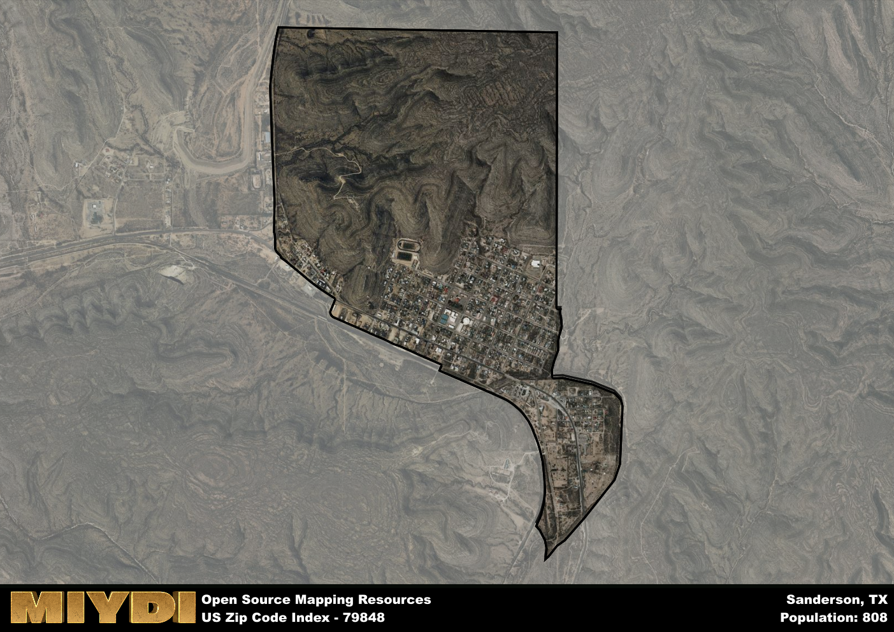

**Area Name:** Sanderson

**Zip Code:** 79848

**State:** TX

# Sanderson: A Charming Oasis in West Texas  
Sanderson, located within the zip code 79848, is a small town situated in the western region of Texas. Surrounded by vast desert landscapes, Sanderson is bordered by the Big Bend National Park to the south and the sprawling Chihuahuan Desert to the north. Despite its remote location, Sanderson serves as a vital hub for travelers exploring the scenic wonders of West Texas, with highways connecting it to nearby cities such as Fort Stockton and Alpine.

Founded in the late 19th century, Sanderson has a rich history rooted in the development of the railroad system in Texas. Originally established as a water and fuel stop for trains, the town quickly grew into a bustling community with the arrival of settlers and businesses. Named after a local pioneer, Sanderson retains its frontier charm with historic buildings lining the main street, showcasing the town's heritage and resilience in the face of challenges such as harsh desert conditions and economic downturns.

Today, Sanderson is a peaceful haven for residents and visitors seeking a tranquil retreat amidst the rugged beauty of West Texas. The town's economy is sustained by agriculture, ranching, and tourism, with local businesses catering to the needs of both residents and travelers passing through. Visitors can explore nearby attractions such as the Sanderson Cemetery, which dates back to the town's early days, or enjoy outdoor activities like hiking, birdwatching, and stargazing in the pristine wilderness surrounding Sanderson. With its small-town charm and connection to the natural wonders of the region, Sanderson continues to thrive as a hidden gem in the heart of West Texas.

# Sanderson Demographics

The population of Sanderson is 808.  
Sanderson has a population density of 370.64 per square mile.  
The area of Sanderson is 2.18 square miles.  

## Sanderson AI and Census Variables

The values presented in this dataset for Sanderson are AI-optimized, streamlined, and categorized into relevant buckets for enhanced utility in AI and mapping programs. These simplified values have been optimized to facilitate efficient analysis and integration into various technological applications, offering users accessible and actionable insights into demographics within the Sanderson area.

| AI Variables for Sanderson | Value |
|-------------|-------|
| Shape Area | 7586495.35546875 |
| Shape Length | 13726.9893771185 |

## How to use this free AI optimized Geo-Spatial Data for Sanderson, TX

This data is made freely available under the Creative Commons license, allowing for unrestricted use for any purpose. Users can access static resources directly from GitHub or leverage more advanced functionalities by utilizing the GeoJSON files. All datasets originate from official government or private sector sources and are meticulously compiled into relevant datasets within QGIS. However, the versatility of the data ensures compatibility with any mapping application.

## Data Accuracy Disclaimer
It's important to note that the data provided here may contain errors or discrepancies and should be considered as 'close enough' for business applications and AI rather than a definitive source of truth. This data is aggregated from multiple sources, some of which publish information on wildly different intervals, leading to potential inconsistencies. Additionally, certain data points may not be corrected for Covid-related changes, further impacting accuracy. Moreover, the assumption that demographic trends are consistent throughout a region may lead to discrepancies, as trends often concentrate in areas of highest population density. As a result, dense areas may be slightly underrepresented, while rural areas may be slightly overrepresented, resulting in a more conservative dataset. Furthermore, the focus primarily on areas within US Major and Minor Statistical areas means that approximately 40 million Americans living outside of these areas may not be fully represented. Lastly, the historical background and area descriptions generated using AI are susceptible to potential mistakes, so users should exercise caution when interpreting the information provided.
