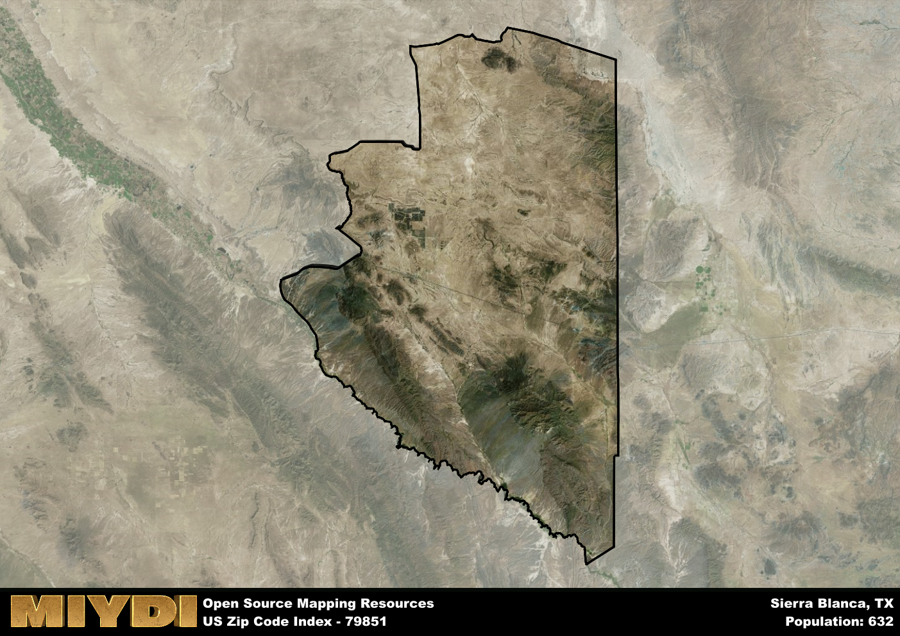

**Area Name:** Sierra Blanca

**Zip Code:** 79851

**State:** TX

Sierra Blanca is a part of the El Paso - TX Metro Area, and makes up 0.07% of the Metro's population.  

# Sierra Blanca: A Charming Oasis in West Texas

Sierra Blanca, located within the 79851 zip code, is a quaint town nestled in the high desert region of West Texas. Surrounded by the majestic Sierra Blanca mountain range, this area serves as a gateway to the larger cities of El Paso and Midland. The zip code encompasses the charming downtown area, residential neighborhoods, and vast expanses of desert landscape, offering residents a peaceful and scenic environment.

Originally settled by Spanish explorers in the 16th century, Sierra Blanca has a rich history intertwined with the development of the American Southwest. The town flourished during the railroad era as a key stop along the Southern Pacific Railroad, attracting settlers and traders. Over the years, Sierra Blanca has maintained its small-town charm while evolving into a hub for tourism and outdoor recreation, drawing visitors from near and far to explore its historic sites and natural beauty.

Today, Sierra Blanca boasts a thriving economy supported by agriculture, tourism, and small businesses. The town offers a variety of services for residents, including schools, healthcare facilities, and local shops. Outdoor enthusiasts can enjoy hiking, camping, and fishing in the nearby mountains and rivers, while history buffs can explore the town's museums and heritage sites. With its unique blend of history, culture, and natural beauty, Sierra Blanca continues to be a hidden gem in the vast landscape of West Texas.

# Sierra Blanca Demographics

The population of Sierra Blanca is 632.  
Sierra Blanca has a population density of 0.31 per square mile.  
The area of Sierra Blanca is 2015.83 square miles.  

### Exploring Real Estate Trends: A Comprehensive Analysis of the Sierra Blanca Area and its Neighbors

This table contains an in-depth examination of the real estate market in the Sierra Blanca area. Sourced from trusted real estate market firms, this dataset provides a wealth of raw data detailing the local real estate landscape, along with comparative analyses juxtaposing the market dynamics with those of neighboring areas. Explore the intricacies of the Sierra Blanca real estate market and gain valuable insights into its relationship with adjacent regions.

| Real Estate Data for Sierra Blanca                       | Value    |
|------------------------------------------------|----------|
| Average Listing Price for Sierra Blanca               | 227500 |
| Median Listing Price for Sierra Blanca                | 227500 |
| Median Days on Market for Sierra Blanca               | 126 |
| Median Listing Price per Square Foot for Sierra Blanca| 70 |
| Median Square Feet for Sierra Blanca                  | 1326 |
| Real Estate Prices to Income Ratio           | 207.36% |
| Price per Square Foot Ratio                  | 115.29% |
| Price Median Ratio                           | 78.25% |
| Market Sales Speed Ratio                     | 184.6% |

This table offers essential real estate data for the Sierra Blanca area, including average and median listing prices, median days on market, and property size. It also presents ratio metrics as percentages, providing insights into how the local market compares to the surrounding region. A ratio of 100% signifies performance in line with the regional average, while values above or below indicate overperformance or underperformance, respectively, relative to expectations.

## Sierra Blanca Sports and Recreation Data

#### Annual Youth Sports Spending for Sierra Blanca

This table provides fundamental insights into the Sports and Recreation data for the Sierra Blanca area, detailing the estimated annual expenditure on Youth Athletics. This includes estimated spending by the major consumer brackets. 
| Sports Spending for Sierra Blanca| Value |
|-------------------------|-------|
| Athlete Spending Compared to the region | 1.90% |
| Total Youth Athlete Spending | 8,780 |
| Athletic Spending - Essential Focused Consumer | 4,935 |
| Athletic Spending - Typical Consumer | 4,650 |
| Athletic Spending - Affluent Consumers | 9,174 |

#### Youth Coaching Estimates for Sierra Blanca

This table presents the estimated number of coaches for the Sierra Blanca area, derived from comprehensive national coaching surveys and athletic participation rates by state. It offers valuable insights into the vital role of coaching personnel in fostering athletic development and facilitating sports participation within the local community.

| Coaching Data for Sierra Blanca | Value |
|-------------|-------|
| Total Coaches | 10 |
| Paid Coaches | 3 |
| Volunteer Coaches | 8 |

#### Youth Athlete Participation for Sierra Blanca

This table shows the estimated total number of youth athletes in the Sierra Blanca area, sourced from comprehensive national coaching surveys and athletic participation rates by state.

| Total YA Athletes in Sierra Blanca | Value |
|-------------|-------|
| Total High School Athletes | 16 |
| Total Youth Athletes | 47 |
| Total Young Adult Athletes | 32 |
| Total Athletes to Age 25 | 95 |

#### High School Age Athletes - Breakdown by Sport for Sierra Blanca

This table shows insights regarding high school age estimated players by sport in the Sierra Blanca area, derived from national and state-level athletic participation trends. 

| HS Players by Sport in Sierra Blanca | Value |
|-------------|-------|
| Football Players | 4 |
| Basketball Players | 2 |
| Soccer Players | 2 |
| Volleyball Players | 1 |
| Baseball Players | 2 |
| Tennis Players | 1 |
| Track Athletes | 3 |
| Golf Players | 0 |
| Swimming Athletes | 0 |
| Wrestling Competitors | 0 |
| Lacrosse Players | 0 |

Estimating the number of younger athletes presents unique challenges due to their varied starting ages, typically beginning around six years old, and a gradual decline in participation rates as they age. Unlike high school-aged athletes, younger athletes are less likely to switch sports as they grow older, contributing to the stability of participation numbers within specific sports at younger ages.  

As a general trend, the total number of younger athletes is approximately three times the number of high school-aged athletes, underscoring the significant presence of youth athletes in sports programs and highlighting the importance of early engagement in athletic activities.

## Sierra Blanca AI and Census Variables

The values presented in this dataset for Sierra Blanca are AI-optimized, streamlined, and categorized into relevant buckets for enhanced utility in AI and mapping programs. These simplified values have been optimized to facilitate efficient analysis and integration into various technological applications, offering users accessible and actionable insights into demographics within the Sierra Blanca area.

| AI Variables for Sierra Blanca | Value |
|-------------|-------|
| Shape Area | 7154609630.78516 |
| Shape Length | 457953.31513325 |
| CBSA Federal Processing Standard Code | 21340 |
| RE Price per Square Foot Ratio | 115.29% |
| RE Speed Ratio | 184.6% |
| RE Income Ratio | 207.36% |
| Income Bracket Flag | 1 |
| RE Income Flag | 6 |
| RE Median Square Footage Price Flag | 4 |
| RE Median Square Footage Size Flag | 2 |
| RE Activity Flag | 7 |
| Poverty Line Risk Flag | 1 |

## How to use this free AI optimized Geo-Spatial Data for Sierra Blanca, TX

This data is made freely available under the Creative Commons license, allowing for unrestricted use for any purpose. Users can access static resources directly from GitHub or leverage more advanced functionalities by utilizing the GeoJSON files. All datasets originate from official government or private sector sources and are meticulously compiled into relevant datasets within QGIS. However, the versatility of the data ensures compatibility with any mapping application.

## Data Accuracy Disclaimer
It's important to note that the data provided here may contain errors or discrepancies and should be considered as 'close enough' for business applications and AI rather than a definitive source of truth. This data is aggregated from multiple sources, some of which publish information on wildly different intervals, leading to potential inconsistencies. Additionally, certain data points may not be corrected for Covid-related changes, further impacting accuracy. Moreover, the assumption that demographic trends are consistent throughout a region may lead to discrepancies, as trends often concentrate in areas of highest population density. As a result, dense areas may be slightly underrepresented, while rural areas may be slightly overrepresented, resulting in a more conservative dataset. Furthermore, the focus primarily on areas within US Major and Minor Statistical areas means that approximately 40 million Americans living outside of these areas may not be fully represented. Lastly, the historical background and area descriptions generated using AI are susceptible to potential mistakes, so users should exercise caution when interpreting the information provided.
