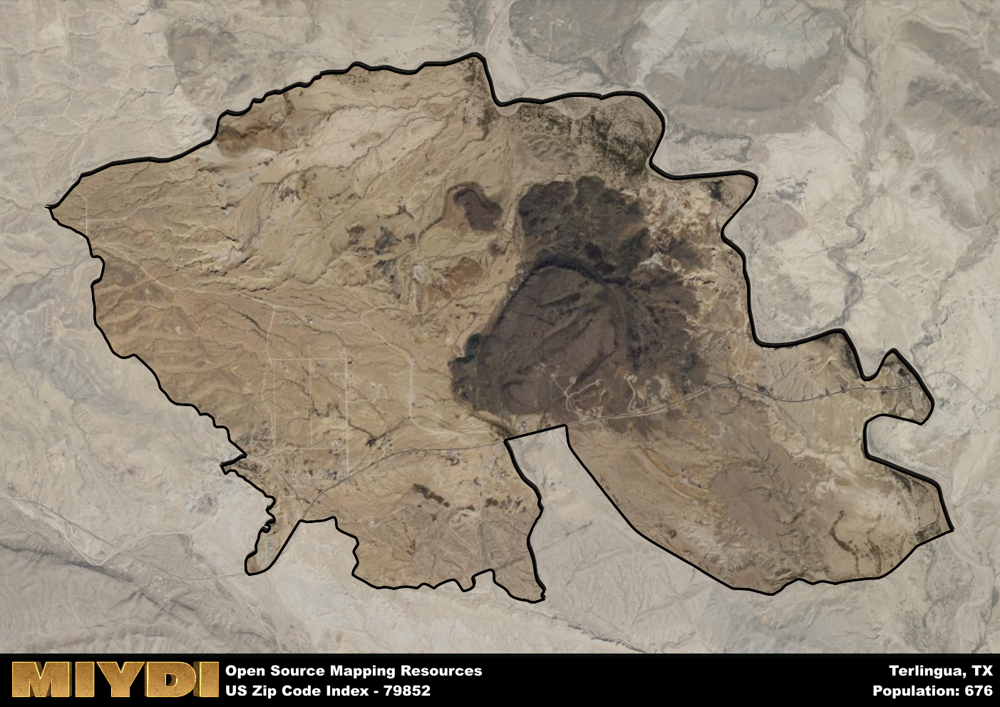

**Area Name:** Terlingua

**Zip Code:** 79852

**State:** TX

# Terlingua: A Unique Neighborhood in Southwest Texas  

Located in the remote desert region of Southwest Texas, zip code 79852 encompasses the small community of Terlingua. Situated near the border with Mexico, Terlingua is surrounded by vast stretches of desert landscape and is approximately 80 miles from the nearest major city, Alpine. Despite its isolation, Terlingua is known for its unique charm and rugged beauty, attracting visitors seeking a taste of the Old West in a picturesque setting.  

Originally settled as a mining town in the late 19th century, Terlingua boomed during the early 1900s due to the discovery of mercury in the area. The town thrived as miners flocked to the region, creating a bustling community complete with schools, stores, and saloons. However, the decline of the mining industry led to a sharp population decrease, and Terlingua became a ghost town by the mid-20th century. In recent years, the area has experienced a revival as a tourist destination, drawing visitors with its historic ruins, annual chili cook-off, and proximity to Big Bend National Park.  

Today, Terlingua is a thriving community with a mix of permanent residents and seasonal visitors. The economy is largely driven by tourism, with local businesses catering to outdoor enthusiasts, history buffs, and nature lovers. The neighborhood boasts a range of services, including restaurants, lodging options, and outdoor outfitters. Residents and visitors alike can explore the area's rich history through tours of the old mining ruins or take in the stunning desert vistas while hiking, biking, or birdwatching. Terlingua's unique blend of history, culture, and natural beauty makes it a hidden gem in the vast landscape of Southwest Texas.  

# Terlingua Demographics

The population of Terlingua is 676.  
Terlingua has a population density of 73.72 per square mile.  
The area of Terlingua is 9.17 square miles.  

## Terlingua Income and Economic Data

These demographic numbers are sourced from IRS return data, providing comprehensive insights into the population dynamics and economic trends within Terlingua.

**Breakdown of return types for Terlingua**

The table offers insight into the composition of tax returns filed with the IRS, categorizing them into three main types. Single returns represent filings by individuals, joint returns by married couples, and head of household returns by individuals who qualify as heads of households, typically having dependents. This breakdown provides an understanding of the different filing statuses adopted by taxpayers when submitting their tax documentation.

| Return Types filed for Terlingua                              | Percentage          |
|----------------------------------------------------------|---------------------|
| Single Returns                                            | 0.59 |
| Joint Returns                                             | 0.28 |
| Head Household Returns                                    | 0.09 |

The income and economic data presented here is sourced from the IRS income brackets, utilized for categorizing tax returns by income levels. This table displays income ranges for both single filers and married couples, along with the corresponding number of returns and the percentage within each bracket, providing valuable insight into the distribution of taxes across various income groups.

| Bracket Name       | Single Filer Income Range | Married Couple Range | Number of Returns | Percentage of Returns |
|--------------------|----------------------------|----------------------|-------------------|-----------------------|
| 10% Bracket        | Up to $10,275              | Up to $20,550        | 200 | 0.43% |
| 12% Bracket        | $10,276 - $41,775          | $20,551 - $83,550    | 140 | 0.3% |
| 22% Bracket        | $41,776 - $89,075          | $83,551 - $178,150   | 50 | 0.11% |
| 24% Bracket        | $89,076 - $170,050         | $178,151 - $340,100  | 30 | 0.07% |
| 32% Bracket        | $170,051 - $215,950        | $340,101 - $431,900  | 40 | 0.09% |
| 35% Bracket        | $215,951 - $539,900        | $431,901 - $647,850  | 0 | 0% |

### Exploring Taxpayer Diversity: A Breakdown of Different Types of Tax Returns in Terlingua

The table offers insights into various types of tax returns filed, reflecting different aspects of taxpayer activities and demographics. Categories include charitable returns for donations, dependent returns for claimed dependents, educator population, elderly population, real estate returns, self-employment returns, student loan returns, and unemployment returns, providing valuable insights into taxpayer behavior and demographics.

| Terlingua Filing Types                    | Count | Percentage |
|--------------------------------------|-------|------------|
| Charitable Donations                 | 0 | 0% |
| Dependents Claimed                   | 0 | 0% |
| Educator Residents                   | 0 | 0% |
| Elderly Population                   | 160 | 0.35% |
| Farming Population                   | 0 | 0% |
| Real Estate Transactions             | 0 | 0% |
| Self-Employed Individuals            | 80 | 0.174% |
| Student Loan Cases                   | 0 | 0% |
| Unemployment Benefit Filings         | 90 | 0.2% |

## Terlingua AI and Census Variables

The values presented in this dataset for Terlingua are AI-optimized, streamlined, and categorized into relevant buckets for enhanced utility in AI and mapping programs. These simplified values have been optimized to facilitate efficient analysis and integration into various technological applications, offering users accessible and actionable insights into demographics within the Terlingua area.

| AI Variables for Terlingua | Value |
|-------------|-------|
| Shape Area | 31351223.484375 |
| Shape Length | 33738.6878008445 |

## How to use this free AI optimized Geo-Spatial Data for Terlingua, TX

This data is made freely available under the Creative Commons license, allowing for unrestricted use for any purpose. Users can access static resources directly from GitHub or leverage more advanced functionalities by utilizing the GeoJSON files. All datasets originate from official government or private sector sources and are meticulously compiled into relevant datasets within QGIS. However, the versatility of the data ensures compatibility with any mapping application.

## Data Accuracy Disclaimer
It's important to note that the data provided here may contain errors or discrepancies and should be considered as 'close enough' for business applications and AI rather than a definitive source of truth. This data is aggregated from multiple sources, some of which publish information on wildly different intervals, leading to potential inconsistencies. Additionally, certain data points may not be corrected for Covid-related changes, further impacting accuracy. Moreover, the assumption that demographic trends are consistent throughout a region may lead to discrepancies, as trends often concentrate in areas of highest population density. As a result, dense areas may be slightly underrepresented, while rural areas may be slightly overrepresented, resulting in a more conservative dataset. Furthermore, the focus primarily on areas within US Major and Minor Statistical areas means that approximately 40 million Americans living outside of these areas may not be fully represented. Lastly, the historical background and area descriptions generated using AI are susceptible to potential mistakes, so users should exercise caution when interpreting the information provided.
