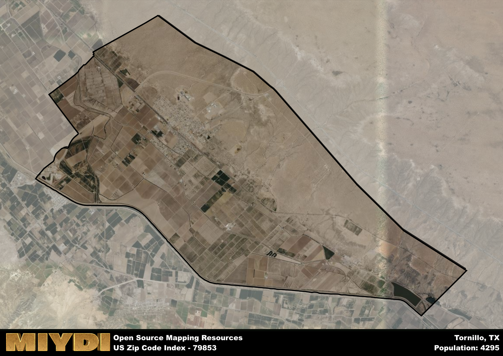

**Area Name:** Tornillo

**Zip Code:** 79853

**State:** TX

Tornillo is a part of the El Paso - TX Metro Area, and makes up 0.44% of the Metro's population.  

# Tornillo: A Historic Zip Code in West Texas  

Located in the far west region of Texas, zip code 79853 encompasses the charming neighborhood of Tornillo. Situated within El Paso County, Tornillo is surrounded by vast desert landscapes and is approximately 40 miles southeast of the city of El Paso. Despite its rural setting, Tornillo is an integral part of the larger El Paso metropolitan area, serving as a peaceful retreat from the bustling city life while still maintaining close ties to urban amenities and services.

Tornillo has a rich historical narrative that dates back to its establishment as a farming community in the late 19th century. The area experienced significant growth during the early 20th century, with the construction of the Tornillo-Guadalupe Port of Entry in 1928 further boosting its economic development. The neighborhood derived its name from the Spanish word for "screw," a nod to the agricultural tool used by early settlers in the area. Today, Tornillo retains its agricultural roots while also embracing modern industries and technologies that contribute to its unique identity.

Presently, Tornillo boasts a thriving agricultural sector, with cotton and pecan farming being prominent economic activities in the area. The neighborhood is also known for its peaceful atmosphere, making it a desirable residential community for those seeking a tranquil lifestyle. Tornillo offers a variety of local services, including schools, grocery stores, and small businesses, catering to the needs of its residents. Additionally, the Tornillo Landmark Historic District showcases the neighborhood's rich cultural heritage, with well-preserved buildings and landmarks that offer a glimpse into its past.

# Tornillo Demographics

The population of Tornillo is 4295.  
Tornillo has a population density of 129.95 per square mile.  
The area of Tornillo is 33.05 square miles.  

### Exploring Real Estate Trends: A Comprehensive Analysis of the Tornillo Area and its Neighbors

This table contains an in-depth examination of the real estate market in the Tornillo area. Sourced from trusted real estate market firms, this dataset provides a wealth of raw data detailing the local real estate landscape, along with comparative analyses juxtaposing the market dynamics with those of neighboring areas. Explore the intricacies of the Tornillo real estate market and gain valuable insights into its relationship with adjacent regions.

| Real Estate Data for Tornillo                       | Value    |
|------------------------------------------------|----------|
| Real Estate Prices to Income Ratio           | 1.919 |

This table offers essential real estate data for the Tornillo area, including average and median listing prices, median days on market, and property size. It also presents ratio metrics as percentages, providing insights into how the local market compares to the surrounding region. A ratio of 100% signifies performance in line with the regional average, while values above or below indicate overperformance or underperformance, respectively, relative to expectations.

## Tornillo Sports and Recreation Data

#### Annual Youth Sports Spending for Tornillo

This table provides fundamental insights into the Sports and Recreation data for the Tornillo area, detailing the estimated annual expenditure on Youth Athletics. This includes estimated spending by the major consumer brackets. 
| Sports Spending for Tornillo| Value |
|-------------------------|-------|
| Athlete Spending Compared to the region | 12.89% |
| Total Youth Athlete Spending | 70,317 |
| Athletic Spending - Essential Focused Consumer | 01,077 |
| Athletic Spending - Typical Consumer | 02,741 |
| Athletic Spending - Affluent Consumers | 66,358 |

#### Youth Coaching Estimates for Tornillo

This table presents the estimated number of coaches for the Tornillo area, derived from comprehensive national coaching surveys and athletic participation rates by state. It offers valuable insights into the vital role of coaching personnel in fostering athletic development and facilitating sports participation within the local community.

| Coaching Data for Tornillo | Value |
|-------------|-------|
| Total Coaches | 70 |
| Paid Coaches | 18 |
| Volunteer Coaches | 52 |

#### Youth Athlete Participation for Tornillo

This table shows the estimated total number of youth athletes in the Tornillo area, sourced from comprehensive national coaching surveys and athletic participation rates by state.

| Total YA Athletes in Tornillo | Value |
|-------------|-------|
| Total High School Athletes | 107 |
| Total Youth Athletes | 322 |
| Total Young Adult Athletes | 215 |
| Total Athletes to Age 25 | 644 |

#### High School Age Athletes - Breakdown by Sport for Tornillo

This table shows insights regarding high school age estimated players by sport in the Tornillo area, derived from national and state-level athletic participation trends. 

| HS Players by Sport in Tornillo | Value |
|-------------|-------|
| Football Players | 25 |
| Basketball Players | 15 |
| Soccer Players | 12 |
| Volleyball Players | 8 |
| Baseball Players | 13 |
| Tennis Players | 6 |
| Track Athletes | 18 |
| Golf Players | 3 |
| Swimming Athletes | 3 |
| Wrestling Competitors | 3 |
| Lacrosse Players | 0 |

Estimating the number of younger athletes presents unique challenges due to their varied starting ages, typically beginning around six years old, and a gradual decline in participation rates as they age. Unlike high school-aged athletes, younger athletes are less likely to switch sports as they grow older, contributing to the stability of participation numbers within specific sports at younger ages.  

As a general trend, the total number of younger athletes is approximately three times the number of high school-aged athletes, underscoring the significant presence of youth athletes in sports programs and highlighting the importance of early engagement in athletic activities.

## Tornillo AI and Census Variables

The values presented in this dataset for Tornillo are AI-optimized, streamlined, and categorized into relevant buckets for enhanced utility in AI and mapping programs. These simplified values have been optimized to facilitate efficient analysis and integration into various technological applications, offering users accessible and actionable insights into demographics within the Tornillo area.

| AI Variables for Tornillo | Value |
|-------------|-------|
| Shape Area | 117926599.472656 |
| Shape Length | 50411.2116497504 |
| CBSA Federal Processing Standard Code | 21340 |
| RE Income Ratio | 1.919 |
| RE Activity Flag | 1 |

## How to use this free AI optimized Geo-Spatial Data for Tornillo, TX

This data is made freely available under the Creative Commons license, allowing for unrestricted use for any purpose. Users can access static resources directly from GitHub or leverage more advanced functionalities by utilizing the GeoJSON files. All datasets originate from official government or private sector sources and are meticulously compiled into relevant datasets within QGIS. However, the versatility of the data ensures compatibility with any mapping application.

## Data Accuracy Disclaimer
It's important to note that the data provided here may contain errors or discrepancies and should be considered as 'close enough' for business applications and AI rather than a definitive source of truth. This data is aggregated from multiple sources, some of which publish information on wildly different intervals, leading to potential inconsistencies. Additionally, certain data points may not be corrected for Covid-related changes, further impacting accuracy. Moreover, the assumption that demographic trends are consistent throughout a region may lead to discrepancies, as trends often concentrate in areas of highest population density. As a result, dense areas may be slightly underrepresented, while rural areas may be slightly overrepresented, resulting in a more conservative dataset. Furthermore, the focus primarily on areas within US Major and Minor Statistical areas means that approximately 40 million Americans living outside of these areas may not be fully represented. Lastly, the historical background and area descriptions generated using AI are susceptible to potential mistakes, so users should exercise caution when interpreting the information provided.
