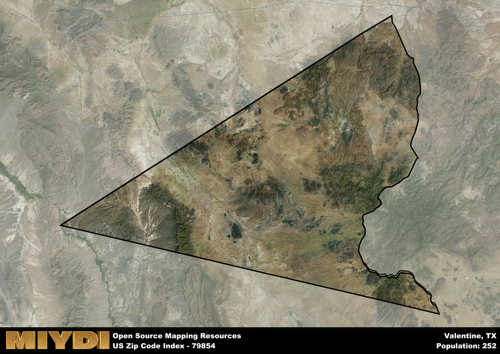

**Area Name:** Valentine

**Zip Code:** 79854

**State:** TX

Valentine is a part of the El Paso - TX Metro Area, and makes up  of the Metro's population.  

# Valentine: A Charming Oasis in West Texas

Located in the remote and rugged landscape of West Texas, zip code 79854 encompasses the small town of Valentine. Surrounded by vast stretches of desert and mountains, Valentine is a tranquil oasis in the midst of the Chihuahuan Desert. The town is situated near the border with Mexico and is approximately 36 miles southwest of the larger city of Marfa. Despite its isolation, Valentine serves as a gateway to nearby attractions such as Big Bend National Park and the Davis Mountains, making it a popular stop for travelers exploring the region.

Valentine has a rich history dating back to the late 19th century when it was established as a water stop for the Southern Pacific Railroad. The town was officially founded in 1882 and named after a railroad executive. Over the years, Valentine has evolved into a close-knit community known for its friendly residents and quirky charm. One of the town's most famous landmarks is the Valentine Post Office, which receives thousands of cards each year around Valentine's Day to be stamped with the unique "Valentine, TX" postmark.

Today, Valentine maintains its small-town feel while offering essential services such as a grocery store, gas station, and local restaurants. The town is a popular destination for stargazing and outdoor enthusiasts, with opportunities for hiking, birdwatching, and photography. Visitors can also explore the historic adobe buildings, including the old schoolhouse and church. With its peaceful atmosphere and stunning desert landscapes, Valentine continues to captivate those seeking a unique experience in the heart of West Texas.

# Valentine Demographics

The population of Valentine is 252.  
Valentine has a population density of 0.27 per square mile.  
The area of Valentine is 947.38 square miles.  

## Valentine AI and Census Variables

The values presented in this dataset for Valentine are AI-optimized, streamlined, and categorized into relevant buckets for enhanced utility in AI and mapping programs. These simplified values have been optimized to facilitate efficient analysis and integration into various technological applications, offering users accessible and actionable insights into demographics within the Valentine area.

| AI Variables for Valentine | Value |
|-------------|-------|
| Shape Area | 3331271303.92969 |
| Shape Length | 306902.993030856 |
| CBSA Federal Processing Standard Code | 21340 |

## How to use this free AI optimized Geo-Spatial Data for Valentine, TX

This data is made freely available under the Creative Commons license, allowing for unrestricted use for any purpose. Users can access static resources directly from GitHub or leverage more advanced functionalities by utilizing the GeoJSON files. All datasets originate from official government or private sector sources and are meticulously compiled into relevant datasets within QGIS. However, the versatility of the data ensures compatibility with any mapping application.

## Data Accuracy Disclaimer
It's important to note that the data provided here may contain errors or discrepancies and should be considered as 'close enough' for business applications and AI rather than a definitive source of truth. This data is aggregated from multiple sources, some of which publish information on wildly different intervals, leading to potential inconsistencies. Additionally, certain data points may not be corrected for Covid-related changes, further impacting accuracy. Moreover, the assumption that demographic trends are consistent throughout a region may lead to discrepancies, as trends often concentrate in areas of highest population density. As a result, dense areas may be slightly underrepresented, while rural areas may be slightly overrepresented, resulting in a more conservative dataset. Furthermore, the focus primarily on areas within US Major and Minor Statistical areas means that approximately 40 million Americans living outside of these areas may not be fully represented. Lastly, the historical background and area descriptions generated using AI are susceptible to potential mistakes, so users should exercise caution when interpreting the information provided.
