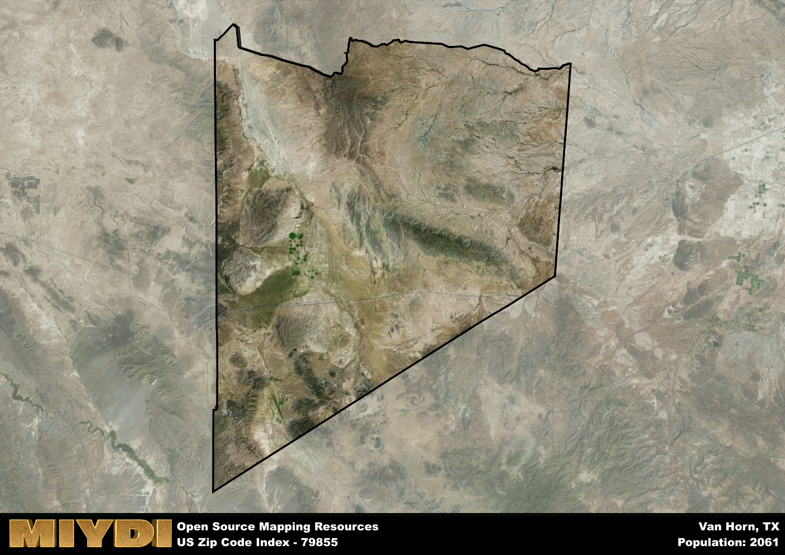

**Area Name:** Van Horn

**Zip Code:** 79855

**State:** TX

Van Horn is a part of the El Paso - TX Metro Area, and makes up 3.71% of the Metro's population.  

# Van Horn: A Historic Oasis in West Texas  

Located in the heart of West Texas, the zip code 79855 area encompasses the charming town of Van Horn. Situated in Culberson County, Van Horn serves as a pivotal hub connecting the vast West Texas region with its proximity to major highways and routes. Surrounded by the stunning beauty of the Chihuahuan Desert, Van Horn provides a tranquil escape for residents and visitors alike while also serving as a key stopover for travelers journeying through the area.  

Van Horn boasts a rich historical narrative that dates back to its founding in the late 19th century. Originally established as a railroad town, Van Horn grew rapidly due to its strategic location along the Southern Pacific Railroad. The town played a significant role in the development of West Texas, attracting settlers, traders, and adventurers seeking opportunities in the region. Over the years, Van Horn has preserved its unique character and identity, honoring its heritage through various community events and historical landmarks.  

Today, Van Horn thrives as a vibrant community with a diverse economy that includes agriculture, tourism, and small businesses. The town offers a range of services for residents, including schools, healthcare facilities, and recreational amenities such as parks and sports facilities. Visitors can explore the area's natural beauty at nearby attractions like Guadalupe Mountains National Park and Big Bend National Park, making Van Horn an ideal base for outdoor enthusiasts and history buffs alike.

# Van Horn Demographics

The population of Van Horn is 2061.  
Van Horn has a population density of 0.91 per square mile.  
The area of Van Horn is 2255.21 square miles.  

### Exploring Real Estate Trends: A Comprehensive Analysis of the Van Horn Area and its Neighbors

This table contains an in-depth examination of the real estate market in the Van Horn area. Sourced from trusted real estate market firms, this dataset provides a wealth of raw data detailing the local real estate landscape, along with comparative analyses juxtaposing the market dynamics with those of neighboring areas. Explore the intricacies of the Van Horn real estate market and gain valuable insights into its relationship with adjacent regions.

| Real Estate Data for Van Horn                       | Value    |
|------------------------------------------------|----------|
| Average Listing Price for Van Horn               | 171429 |
| Median Listing Price for Van Horn                | 125000 |
| Median Days on Market for Van Horn               | 83 |
| Median Listing Price per Square Foot for Van Horn| 02 |
| Median Square Feet for Van Horn                  | 1332 |
| Real Estate Prices to Income Ratio           | 147.69% |
| Price per Square Foot Ratio                  | 77.49% |
| Price Median Ratio                           | 49.72% |
| Market Sales Speed Ratio                     | 91.1% |

This table offers essential real estate data for the Van Horn area, including average and median listing prices, median days on market, and property size. It also presents ratio metrics as percentages, providing insights into how the local market compares to the surrounding region. A ratio of 100% signifies performance in line with the regional average, while values above or below indicate overperformance or underperformance, respectively, relative to expectations.

## Van Horn Sports and Recreation Data

#### Annual Youth Sports Spending for Van Horn

This table provides fundamental insights into the Sports and Recreation data for the Van Horn area, detailing the estimated annual expenditure on Youth Athletics. This includes estimated spending by the major consumer brackets. 
| Sports Spending for Van Horn| Value |
|-------------------------|-------|
| Athlete Spending Compared to the region | 37.09% |
| Total Youth Athlete Spending | 21,560 |
| Athletic Spending - Essential Focused Consumer | 8,466 |
| Athletic Spending - Typical Consumer | 45,288 |
| Athletic Spending - Affluent Consumers | 27,738 |

#### Youth Coaching Estimates for Van Horn

This table presents the estimated number of coaches for the Van Horn area, derived from comprehensive national coaching surveys and athletic participation rates by state. It offers valuable insights into the vital role of coaching personnel in fostering athletic development and facilitating sports participation within the local community.

| Coaching Data for Van Horn | Value |
|-------------|-------|
| Total Coaches | 34 |
| Paid Coaches | 9 |
| Volunteer Coaches | 25 |

#### Youth Athlete Participation for Van Horn

This table shows the estimated total number of youth athletes in the Van Horn area, sourced from comprehensive national coaching surveys and athletic participation rates by state.

| Total YA Athletes in Van Horn | Value |
|-------------|-------|
| Total High School Athletes | 52 |
| Total Youth Athletes | 155 |
| Total Young Adult Athletes | 103 |
| Total Athletes to Age 25 | 309 |

#### High School Age Athletes - Breakdown by Sport for Van Horn

This table shows insights regarding high school age estimated players by sport in the Van Horn area, derived from national and state-level athletic participation trends. 

| HS Players by Sport in Van Horn | Value |
|-------------|-------|
| Football Players | 12 |
| Basketball Players | 7 |
| Soccer Players | 6 |
| Volleyball Players | 4 |
| Baseball Players | 6 |
| Tennis Players | 3 |
| Track Athletes | 9 |
| Golf Players | 2 |
| Swimming Athletes | 2 |
| Wrestling Competitors | 2 |
| Lacrosse Players | 0 |

Estimating the number of younger athletes presents unique challenges due to their varied starting ages, typically beginning around six years old, and a gradual decline in participation rates as they age. Unlike high school-aged athletes, younger athletes are less likely to switch sports as they grow older, contributing to the stability of participation numbers within specific sports at younger ages.  

As a general trend, the total number of younger athletes is approximately three times the number of high school-aged athletes, underscoring the significant presence of youth athletes in sports programs and highlighting the importance of early engagement in athletic activities.

## Van Horn AI and Census Variables

The values presented in this dataset for Van Horn are AI-optimized, streamlined, and categorized into relevant buckets for enhanced utility in AI and mapping programs. These simplified values have been optimized to facilitate efficient analysis and integration into various technological applications, offering users accessible and actionable insights into demographics within the Van Horn area.

| AI Variables for Van Horn | Value |
|-------------|-------|
| Shape Area | 8010919608.33594 |
| Shape Length | 404904.728049015 |
| CBSA Federal Processing Standard Code | 21340 |
| RE Price per Square Foot Ratio | 77.49% |
| RE Price Average Ratio | 60.92% |
| RE Speed Ratio | 91.1% |
| RE Income Ratio | 147.69% |
| RE Affordability Index Flag | 2 |
| Income Bracket Flag | 3 |
| RE Income Flag | 4 |
| RE Median Square Footage Price Flag | 2 |
| RE Median Square Footage Size Flag | 2 |
| RE Activity Flag | 4 |
| Poverty Line Risk Flag | 1 |

## How to use this free AI optimized Geo-Spatial Data for Van Horn, TX

This data is made freely available under the Creative Commons license, allowing for unrestricted use for any purpose. Users can access static resources directly from GitHub or leverage more advanced functionalities by utilizing the GeoJSON files. All datasets originate from official government or private sector sources and are meticulously compiled into relevant datasets within QGIS. However, the versatility of the data ensures compatibility with any mapping application.

## Data Accuracy Disclaimer
It's important to note that the data provided here may contain errors or discrepancies and should be considered as 'close enough' for business applications and AI rather than a definitive source of truth. This data is aggregated from multiple sources, some of which publish information on wildly different intervals, leading to potential inconsistencies. Additionally, certain data points may not be corrected for Covid-related changes, further impacting accuracy. Moreover, the assumption that demographic trends are consistent throughout a region may lead to discrepancies, as trends often concentrate in areas of highest population density. As a result, dense areas may be slightly underrepresented, while rural areas may be slightly overrepresented, resulting in a more conservative dataset. Furthermore, the focus primarily on areas within US Major and Minor Statistical areas means that approximately 40 million Americans living outside of these areas may not be fully represented. Lastly, the historical background and area descriptions generated using AI are susceptible to potential mistakes, so users should exercise caution when interpreting the information provided.
