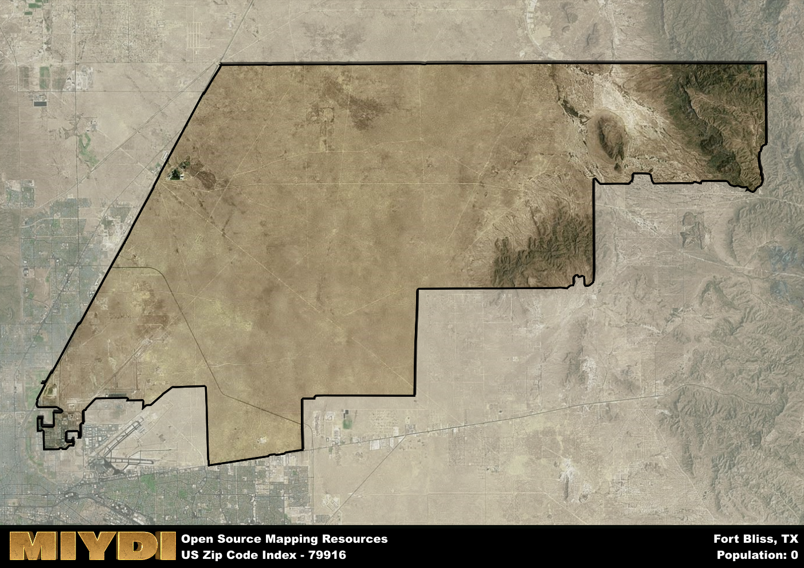

**Area Name:** Fort Bliss

**Zip Code:** 79916

**State:** TX

Fort Bliss is a part of the El Paso - TX Metro Area, and makes up  of the Metro's population.  

# Fort Bliss: A Military Hub in El Paso  

Located in the city of El Paso, Texas, zip code 79916 corresponds to the area commonly known as Fort Bliss. This area is situated in the northeastern part of El Paso, bordering the Franklin Mountains to the west and the Texas-New Mexico border to the north. Fort Bliss is an integral part of the city, functioning as a major military installation and contributing to the local economy and culture. It is closely connected to the surrounding neighborhoods of Northeast El Paso and serves as a significant population center in the region.

Fort Bliss has a rich history dating back to the mid-19th century when it was established as a cavalry post to protect the Texas frontier. Over the years, it has evolved into one of the largest military installations in the United States, playing a crucial role in various military operations and training exercises. The area has witnessed significant growth and development, becoming a hub for military personnel and their families. The name "Fort Bliss" honors Lieutenant Colonel William Wallace Smith Bliss, an influential figure in the early history of the fort.

Today, Fort Bliss remains a vibrant and bustling area with a strong military presence. The base is home to the 1st Armored Division and various other units, contributing to the area's dynamic and diverse population. In addition to its military functions, Fort Bliss offers a range of services, amenities, and recreational opportunities to its residents and visitors. The area boasts a variety of shopping centers, restaurants, and entertainment options, making it a thriving community within the larger urban fabric of El Paso. Visitors can also explore historic sites such as the Fort Bliss Museum, which showcases the rich military heritage of the area.

# Fort Bliss Demographics

The population of Fort Bliss is 0.  
Fort Bliss has a population density of 0 per square mile.  
The area of Fort Bliss is 199.61 square miles.  

## Fort Bliss AI and Census Variables

The values presented in this dataset for Fort Bliss are AI-optimized, streamlined, and categorized into relevant buckets for enhanced utility in AI and mapping programs. These simplified values have been optimized to facilitate efficient analysis and integration into various technological applications, offering users accessible and actionable insights into demographics within the Fort Bliss area.

| AI Variables for Fort Bliss | Value |
|-------------|-------|
| Shape Area | 719748353.28125 |
| Shape Length | 159507.782900295 |
| CBSA Federal Processing Standard Code | 21340 |

## How to use this free AI optimized Geo-Spatial Data for Fort Bliss, TX

This data is made freely available under the Creative Commons license, allowing for unrestricted use for any purpose. Users can access static resources directly from GitHub or leverage more advanced functionalities by utilizing the GeoJSON files. All datasets originate from official government or private sector sources and are meticulously compiled into relevant datasets within QGIS. However, the versatility of the data ensures compatibility with any mapping application.

## Data Accuracy Disclaimer
It's important to note that the data provided here may contain errors or discrepancies and should be considered as 'close enough' for business applications and AI rather than a definitive source of truth. This data is aggregated from multiple sources, some of which publish information on wildly different intervals, leading to potential inconsistencies. Additionally, certain data points may not be corrected for Covid-related changes, further impacting accuracy. Moreover, the assumption that demographic trends are consistent throughout a region may lead to discrepancies, as trends often concentrate in areas of highest population density. As a result, dense areas may be slightly underrepresented, while rural areas may be slightly overrepresented, resulting in a more conservative dataset. Furthermore, the focus primarily on areas within US Major and Minor Statistical areas means that approximately 40 million Americans living outside of these areas may not be fully represented. Lastly, the historical background and area descriptions generated using AI are susceptible to potential mistakes, so users should exercise caution when interpreting the information provided.
