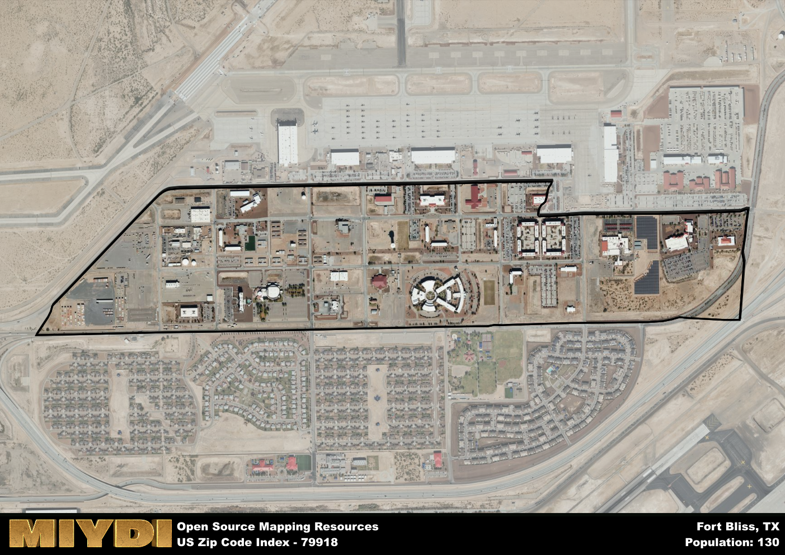

**Area Name:** Fort Bliss

**Zip Code:** 79918

**State:** TX

Fort Bliss is a part of the El Paso - TX Metro Area, and makes up  of the Metro's population.  

# Fort Bliss: A Historic Military Installation in El Paso

Located in the heart of El Paso, Texas, zip code 79918 is home to the renowned military installation known as Fort Bliss. Situated in the northeast part of the city, Fort Bliss is bordered by the Franklin Mountains to the west and the city of Horizon City to the east. This area plays a crucial role in the Greater El Paso metropolitan area, serving as a hub for military operations and contributing to the local economy through its various services and facilities.

Fort Bliss has a rich historical background, dating back to its establishment in 1848 as a U.S. Army post. Throughout its history, the installation has played a significant role in various military conflicts, including the Civil War, World War I, and World War II. Over the years, Fort Bliss has expanded in size and scope, becoming one of the largest military installations in the United States. Its growth has been intertwined with the development of El Paso and has shaped the cultural identity of the surrounding neighborhoods.

Today, Fort Bliss is a thriving community that offers a wide range of amenities and services to its residents and military personnel. The area boasts a diverse economy, with a focus on defense-related industries and government services. In addition to its military functions, Fort Bliss is home to numerous recreational facilities, including golf courses, fitness centers, and outdoor parks. The installation also features several historical sites and museums that celebrate its military heritage, making it a unique and vibrant part of the El Paso landscape.

# Fort Bliss Demographics

The population of Fort Bliss is 130.  
Fort Bliss has a population density of 194.03 per square mile.  
The area of Fort Bliss is 0.67 square miles.  

## Fort Bliss AI and Census Variables

The values presented in this dataset for Fort Bliss are AI-optimized, streamlined, and categorized into relevant buckets for enhanced utility in AI and mapping programs. These simplified values have been optimized to facilitate efficient analysis and integration into various technological applications, offering users accessible and actionable insights into demographics within the Fort Bliss area.

| AI Variables for Fort Bliss | Value |
|-------------|-------|
| Shape Area | 2405646.98046875 |
| Shape Length | 8682.06977939439 |
| CBSA Federal Processing Standard Code | 21340 |

## How to use this free AI optimized Geo-Spatial Data for Fort Bliss, TX

This data is made freely available under the Creative Commons license, allowing for unrestricted use for any purpose. Users can access static resources directly from GitHub or leverage more advanced functionalities by utilizing the GeoJSON files. All datasets originate from official government or private sector sources and are meticulously compiled into relevant datasets within QGIS. However, the versatility of the data ensures compatibility with any mapping application.

## Data Accuracy Disclaimer
It's important to note that the data provided here may contain errors or discrepancies and should be considered as 'close enough' for business applications and AI rather than a definitive source of truth. This data is aggregated from multiple sources, some of which publish information on wildly different intervals, leading to potential inconsistencies. Additionally, certain data points may not be corrected for Covid-related changes, further impacting accuracy. Moreover, the assumption that demographic trends are consistent throughout a region may lead to discrepancies, as trends often concentrate in areas of highest population density. As a result, dense areas may be slightly underrepresented, while rural areas may be slightly overrepresented, resulting in a more conservative dataset. Furthermore, the focus primarily on areas within US Major and Minor Statistical areas means that approximately 40 million Americans living outside of these areas may not be fully represented. Lastly, the historical background and area descriptions generated using AI are susceptible to potential mistakes, so users should exercise caution when interpreting the information provided.
