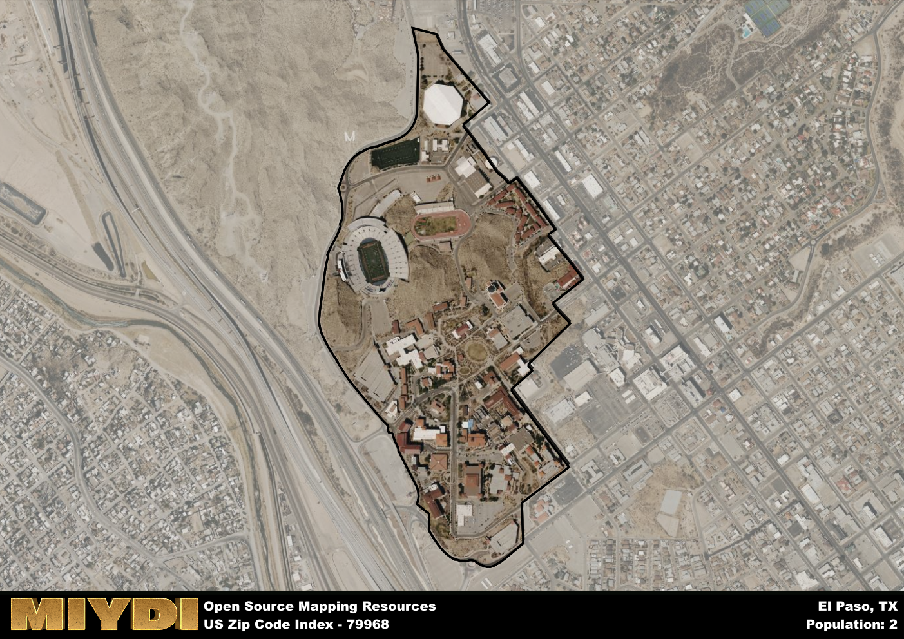

**Area Name:** El Paso

**Zip Code:** 79968

**State:** TX

El Paso is a part of the El Paso - TX Metro Area, and makes up  of the Metro's population.  

# The Vibrant Community of Canutillo in El Paso, Texas  

Located in the western part of El Paso, Texas, the zip code area 79968 encompasses the charming neighborhood of Canutillo. Bordered by the Franklin Mountains to the east and the Rio Grande to the west, Canutillo seamlessly integrates with the larger El Paso metropolitan area. It is situated just a short drive away from downtown El Paso and is well-connected to major highways, allowing residents easy access to the city's amenities.

Canutillo has a rich historical narrative, initially settled by Native American tribes before becoming a Spanish colonial outpost. The area experienced significant growth during the 19th century due to its proximity to the Rio Grande and the development of agriculture. Canutillo earned its name from the abundant "canutillo" plants that grew in the region, providing a distinctive touch to its identity.

Today, Canutillo is a thriving community with a mix of residential, commercial, and agricultural activities. The neighborhood boasts a variety of local businesses, restaurants, and parks, making it a vibrant and close-knit community. Residents and visitors alike can enjoy the nearby Franklin Mountains State Park for outdoor recreation or explore the historic sites that showcase Canutillo's unique heritage.

# El Paso Demographics

The population of El Paso is 2.  
El Paso has a population density of 7.14 per square mile.  
The area of El Paso is 0.28 square miles.  

## El Paso AI and Census Variables

The values presented in this dataset for El Paso are AI-optimized, streamlined, and categorized into relevant buckets for enhanced utility in AI and mapping programs. These simplified values have been optimized to facilitate efficient analysis and integration into various technological applications, offering users accessible and actionable insights into demographics within the El Paso area.

| AI Variables for El Paso | Value |
|-------------|-------|
| Shape Area | 1015459.4765625 |
| Shape Length | 5122.38982059173 |
| CBSA Federal Processing Standard Code | 21340 |

## How to use this free AI optimized Geo-Spatial Data for El Paso, TX

This data is made freely available under the Creative Commons license, allowing for unrestricted use for any purpose. Users can access static resources directly from GitHub or leverage more advanced functionalities by utilizing the GeoJSON files. All datasets originate from official government or private sector sources and are meticulously compiled into relevant datasets within QGIS. However, the versatility of the data ensures compatibility with any mapping application.

## Data Accuracy Disclaimer
It's important to note that the data provided here may contain errors or discrepancies and should be considered as 'close enough' for business applications and AI rather than a definitive source of truth. This data is aggregated from multiple sources, some of which publish information on wildly different intervals, leading to potential inconsistencies. Additionally, certain data points may not be corrected for Covid-related changes, further impacting accuracy. Moreover, the assumption that demographic trends are consistent throughout a region may lead to discrepancies, as trends often concentrate in areas of highest population density. As a result, dense areas may be slightly underrepresented, while rural areas may be slightly overrepresented, resulting in a more conservative dataset. Furthermore, the focus primarily on areas within US Major and Minor Statistical areas means that approximately 40 million Americans living outside of these areas may not be fully represented. Lastly, the historical background and area descriptions generated using AI are susceptible to potential mistakes, so users should exercise caution when interpreting the information provided.
