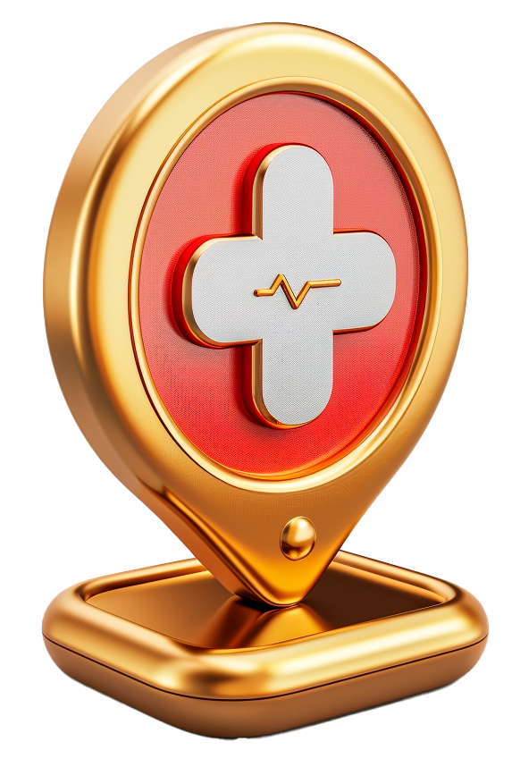

# Miydi Map Icons

## Optimized Icons for Geospatial Mapping

Welcome to the Miydi Map Icons repository! Our icons, crafted with MidJourney and Adobe AI image generators, are specifically designed to enhance the visual appeal and clarity of mapping applications. Below, you'll find insights into how these icons are optimized for your mapping needs.

### Precision and Clarity


Our icons are engineered to provide maximum precision and clarity even at small sizes. This ensures that each icon remains distinct and readable under various mapping scenarios, helping users quickly identify important features without confusion.

### Scalability for Various Zoom Levels


Scalability is key in mapping. Each icon is designed to maintain its integrity across a range of zoom levels. Whether you're viewing a citywide map or zooming into a specific neighborhood, these icons adjust beautifully, ensuring a consistent visual experience.

### Visual Consistency



We've standardized the design elements across all icons to ensure visual consistency throughout your maps. This uniformity helps in maintaining an aesthetically pleasing and cohesive map interface, which is crucial for professional mapping projects.

### Enhanced Color Palette


Colors play a crucial role in mapping. Our icons come with an enhanced color palette that is not only visually engaging but also serves to differentiate between icon categories effectively. This differentiation aids users in navigating complex maps with ease.

## How to Use the Icons in QGIS

### Scale the icons based on zoom level

The default code snippet provided is used within QGIS's Expression Builder to dynamically render feature centroids with scaling based on the map scale and feature size. The map icons used for rendering are stored in the `_styles` directory, and the centroid clusters are set to a maximum display size of 80mm, ensuring that the visual representation is both informative and visually accessible across different zoom levels.

### Explanation of the Code for Feature Centroids

```plaintext
min(
    max(
        sqrt($area) / (@map_scale / 2500) * 0.2,  -- Increased scaling factor for larger size
        12  -- Increased minimum size for better visibility when zoomed in
    ),
    60  -- Slightly increased maximum size for larger appearance when zoomed out
)
